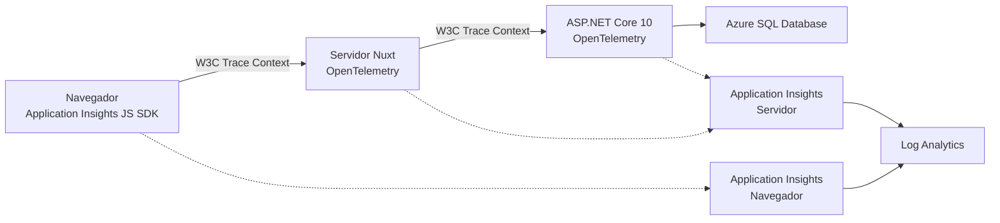

# Arauco Project Hub

## Architecture Decision Record

# ADR-007 - Plataforma y Estándar de Observabilidad

**Versión:** 1.0

**Estado:** Approved

**Fecha:** 2026-06-28

---

# 1. Contexto

La Arquitectura de Observabilidad aprobada exige correlacionar interacciones técnicas entre Frontend, API, Backend y adaptaciones, producir registros, métricas y trazas, y conocer disponibilidad, errores, rendimiento, recursos y dependencias.

También exige mantener la observabilidad separada del Historial, minimizar información y evitar credenciales, secretos y datos sensibles completos.

El Frontend utiliza Nuxt 4 con una sesión mediada por su componente de servidor. El Backend utiliza ASP.NET Core 10 y persiste mediante Azure SQL Database y Entity Framework Core 10.

Permanecen Pendientes:

* La plataforma de observabilidad.
* El estándar de instrumentación.
* El mecanismo de propagación.
* El transporte y destino de señales.
* El tratamiento específico del navegador.
* El muestreo, la retención y los controles de costo.
* Los umbrales, alertas y tableros.

Esta decisión selecciona la base tecnológica. No define valores operacionales que todavía requieren validación.

---

# 2. Fuerzas de Decisión

La alternativa debe:

* Implementar registros, métricas y trazas.
* Correlacionar .NET, Node.js y navegador.
* Utilizar un estándar abierto cuando exista soporte adecuado.
* Integrarse con la plataforma Azure ya seleccionada para persistencia.
* Mantener el Modelo de Dominio independiente.
* Reducir bibliotecas y servicios innecesarios.
* Proteger credenciales, secretos y datos sensibles.
* Mantener señales separadas por Ambiente.
* Permitir consultas, alertas y tableros.
* Controlar volumen y costo.
* Mantener una ruta de evolución sin exigir una plataforma autogestionada.

La plataforma corporativa permitida, la residencia, retención, volumen, costo y responsables operacionales permanecen Pendientes de confirmación.

---

# 3. Opciones Consideradas

## 3.1 OpenTelemetry con Azure Monitor Application Insights

Utilizar OpenTelemetry como estándar principal en componentes de servidor y Azure Monitor Application Insights como destino administrado.

Para navegador, utilizar el SDK JavaScript de Application Insights mientras OpenTelemetry para navegador no tenga soporte recomendado por Azure Monitor.

### Ventajas

* OpenTelemetry estandariza trazas, métricas y registros.
* Azure Monitor proporciona una plataforma administrada alineada con Azure.
* La distribución de Azure Monitor para OpenTelemetry soporta ASP.NET Core y Node.js.
* Application Insights integra solicitudes, dependencias, excepciones, métricas, consultas y alertas.
* El estándar reduce acoplamiento de la instrumentación de servidor.
* W3C Trace Context permite propagación interoperable.
* Evita operar una plataforma completa de observabilidad.

### Desventajas

* La exportación utiliza una distribución optimizada para Azure Monitor.
* El navegador requiere un SDK distinto de OpenTelemetry.
* La telemetría del navegador no admite autenticación con Microsoft Entra ID.
* Volumen, retención y consultas pueden generar costos significativos.
* La configuración incorrecta puede producir trazas incompletas o datos sensibles.

## 3.2 SDK clásicos de Application Insights

Utilizar SDK propietarios de Application Insights en .NET, Node.js y navegador.

### Ventajas

* Integración directa con Application Insights.
* Capacidades maduras para telemetría de aplicaciones.
* Menor traducción conceptual para funcionalidades específicas del proveedor.

### Desventajas

* Aumenta el acoplamiento de componentes de servidor a APIs propietarias.
* Microsoft recomienda OpenTelemetry para proyectos nuevos en .NET y Node.js.
* Reduce portabilidad de instrumentación.
* Mantiene modelos de programación diferentes entre componentes.

## 3.3 OpenTelemetry con plataforma autogestionada

Utilizar OpenTelemetry y operar colectores, almacenamiento, consultas, tableros y alertas mediante una plataforma propia.

### Ventajas

* Mayor control sobre transporte, almacenamiento y retención.
* Mayor independencia del destino.
* Permite seleccionar componentes especializados.

### Desventajas

* Incorpora múltiples servicios y una carga operacional significativa.
* Exige definir alta disponibilidad, respaldo, seguridad y actualización de la propia plataforma.
* No existe una necesidad aprobada que justifique esta complejidad.
* Agrega más puntos de fallo antes de validar volúmenes y objetivos.

## 3.4 Registros técnicos sin trazas ni métricas integradas

Utilizar únicamente registros centralizados.

### Ventajas

* Implementación inicial sencilla.
* Menor cantidad de señales.

### Desventajas

* No cumple la Arquitectura de Observabilidad.
* Dificulta medir rendimiento y correlacionar dependencias.
* Obliga a derivar métricas desde información no diseñada para ese propósito.
* Reduce capacidad de detectar degradación.

---

# 4. Decisión Propuesta

Se propone:

1. Utilizar Azure Monitor Application Insights, conectado a Log Analytics, como plataforma principal de observabilidad.
2. Utilizar OpenTelemetry como estándar de instrumentación para los componentes de servidor.
3. Utilizar la distribución de Azure Monitor para OpenTelemetry en ASP.NET Core 10.
4. Utilizar la distribución de Azure Monitor para OpenTelemetry en el componente de servidor de Nuxt ejecutado sobre Node.js.
5. Utilizar W3C Trace Context para propagar el contexto de trazas.
6. Utilizar el SDK JavaScript de Application Insights para telemetría del navegador mientras OpenTelemetry para navegador no sea una alternativa soportada y recomendada por Azure Monitor.
7. Mantener la instrumentación fuera del Modelo de Dominio.
8. Enviar señales directamente desde los componentes hacia Azure Monitor durante la etapa inicial.
9. No incorporar un OpenTelemetry Collector hasta que exista una necesidad validada de procesamiento, enrutamiento o múltiples destinos.
10. Utilizar recursos separados por Ambiente.
11. Separar la telemetría del navegador de la telemetría de servidor cuando sea necesario para mantener autenticación y controles distintos.
12. Preferir identidad administrada y autenticación con Microsoft Entra ID para la ingesta desde componentes de servidor cuando la plataforma de despliegue lo permita.
13. Mantener autenticación local únicamente donde sea técnicamente necesaria para el SDK de navegador y aislarla del recurso de servidor.
14. Configurar muestreo en el origen para trazas cuando el volumen validado lo requiera.
15. No aplicar muestreo a métricas.
16. Mantener registros estructurados y correlacionados sin utilizar APIs propietarias dentro del dominio.
17. No utilizar telemetría del navegador para analítica funcional de actores sin una necesidad y política aprobadas.

La decisión no aprueba todavía porcentajes de muestreo, retención, límites diarios, métricas personalizadas, alertas, tableros ni niveles de registro.

---

# 5. Vista Propuesta

La asociación concreta entre recursos y espacios de trabajo deberá respetar separación de Ambientes, residencia, acceso y costo.

---

# 6. Instrumentación de Servidor

Los componentes ASP.NET Core y Node.js deben:

* Instrumentar solicitudes entrantes.
* Instrumentar llamadas HTTP salientes.
* Instrumentar dependencias soportadas.
* Capturar excepciones técnicas.
* Producir métricas de runtime y aplicación cuando exista un propósito aprobado.
* Propagar contexto mediante W3C Trace Context.
* Identificar componente, versión y Ambiente mediante atributos acotados.

La instrumentación automática será el punto de partida.

La instrumentación manual se incorporará únicamente cuando:

* Una operación relevante no sea visible automáticamente.
* Se requiera medir un tramo específico.
* Exista una señal operacional aprobada.
* No se duplique información ya disponible.

El Modelo de Dominio no dependerá de OpenTelemetry ni de Azure Monitor.

---

# 7. Instrumentación del Navegador

El navegador utilizará el SDK JavaScript de Application Insights para:

* Vistas y navegación técnica cuando corresponda.
* Solicitudes hacia el servidor de Nuxt.
* Duración y fallos técnicos del navegador.
* Correlación con componentes de servidor.
* Excepciones no controladas necesarias para diagnóstico.

La configuración deberá:

* Limitar recolección automática a información aprobada.
* Evitar cuerpos, credenciales, referencias de sesión y datos sensibles.
* Validar destinos de correlación.
* Evitar identificar actores con datos personales.
* Mantener el recurso y credencial de ingesta separados cuando la autenticación de servidor utilice Microsoft Entra ID.

El SDK del navegador es una excepción técnica explícita al estándar principal OpenTelemetry debido al estado de soporte actual.

---

# 8. Correlación

W3C Trace Context será el mecanismo estándar de propagación entre componentes HTTP.

El contexto:

* Se valida en límites expuestos.
* Se propaga entre navegador, servidor de Nuxt, API y dependencias instrumentadas.
* Permite relacionar trazas y registros.
* No se utiliza como autorización.
* No sustituye identificadores del dominio.
* Puede exponerse como identificador de correlación en errores públicos sin revelar detalles internos.

No se incorporarán identificadores de Iniciativa, Participante o Solicitud como dimensiones de métricas.

---

# 9. Registros, Métricas y Trazas

## 9.1 Registros

Los registros se producirán mediante las capacidades estructuradas de cada plataforma y se integrarán con OpenTelemetry en servidor.

Se configurarán niveles y categorías para evitar:

* Duplicación del mismo error.
* Registros de depuración en Producción sin necesidad temporal.
* Información sensible.
* Volumen sin propósito operacional.

## 9.2 Métricas

Se utilizarán primero las métricas estándar proporcionadas por Azure Monitor y la instrumentación.

Una métrica personalizada requerirá:

* Pregunta operacional explícita.
* Unidad y significado estables.
* Dimensiones acotadas.
* Responsable de interpretación.
* Criterio de uso en tablero o alerta.

Las métricas no serán muestreadas.

## 9.3 Trazas

Las trazas representarán interacciones técnicas y dependencias.

El muestreo:

* Se configurará en el origen.
* Mantendrá decisiones coherentes a través de la traza.
* Se validará con volumen y costo representativos.
* No se establecerá arbitrariamente antes de contar con mediciones.

El muestreo de ingesta se reservará para contingencias donde no sea posible controlar el origen.

---

# 10. Transporte y Destino

Durante la etapa inicial, cada componente enviará señales directamente a Azure Monitor Application Insights mediante las bibliotecas soportadas.

No se incorpora un Collector porque:

* No existe un segundo destino aprobado.
* No existe una necesidad validada de transformación central.
* Agregaría despliegue, disponibilidad y operación propias.
* El envío directo es soportado por las distribuciones seleccionadas.

Se deberá revisar esta decisión si aparece:

* Más de un destino obligatorio.
* Procesamiento central no disponible en el origen.
* Necesidad de aislamiento de red.
* Requisitos de almacenamiento temporal adicionales.
* Volumen que justifique otra topología.

---

# 11. Seguridad

La implementación debe:

* Preferir Microsoft Entra ID para ingesta de servidor.
* Utilizar identidades con privilegios mínimos.
* Mantener conexiones y configuración fuera del repositorio.
* Separar recursos y credenciales por Ambiente.
* Deshabilitar autenticación local en recursos de servidor cuando sea compatible.
* Aislar la ingesta del navegador que requiera autenticación local.
* Aplicar protección antes de exportar señales.
* Restringir consulta y administración mediante permisos.
* Evitar parámetros de URL cuando puedan contener secretos.

La estrategia definitiva depende de la plataforma de despliegue y de los requisitos corporativos de identidad y red.

---

# 12. Volumen y Costo

Antes de Producción se debe:

* Medir volumen por señal y componente.
* Definir retención.
* Evaluar muestreo de trazas.
* Definir límites y alertas de costo.
* Revisar dimensiones de métricas.
* Evitar señales duplicadas.
* Validar el impacto de telemetría del navegador.

Un límite diario puede proteger el costo, pero no reemplaza el control en origen porque puede producir períodos sin señales.

---

# 13. Fallos y Almacenamiento Temporal

Las distribuciones de Azure Monitor pueden almacenar temporalmente señales y reintentar ante desconexión.

La configuración debe:

* Utilizar una ubicación protegida.
* Evitar crecimiento no controlado.
* No bloquear indefinidamente las operaciones.
* No mantener abiertas transacciones.
* Priorizar el resultado del producto sobre la emisión de señales.

La pérdida de una señal técnica no debe producir corrupción ni un cambio parcial. Tampoco debe impedir que el Historial se conserve cuando corresponde.

---

# 14. Consecuencias

## 14.1 Positivas

* Se adopta un estándar abierto en componentes de servidor.
* La plataforma se alinea con Azure y reduce operación propia.
* .NET y Node.js utilizan el mismo modelo de señales.
* Las trazas pueden correlacionarse mediante un estándar web.
* Application Insights proporciona almacenamiento, consultas y experiencias operacionales integradas.
* El dominio permanece independiente.
* La arquitectura puede incorporar otro destino en el futuro sin redefinir el dominio.

## 14.2 Costos y Restricciones

* El navegador requiere un SDK específico de Azure Monitor.
* Se deben administrar recursos, acceso, retención y costo.
* La separación de telemetría de navegador puede requerir recursos adicionales.
* El equipo deberá conocer OpenTelemetry, Application Insights y Log Analytics.
* La instrumentación automática deberá revisarse para evitar datos sensibles y duplicación.

## 14.3 Riesgos

### Acoplamiento a Azure Monitor

La distribución y el destino incorporan capacidades específicas de Azure.

Mitigación:

* Utilizar APIs de OpenTelemetry en servidor.
* Mantener la instrumentación fuera del dominio.
* Evitar APIs propietarias salvo en el adaptador de exportación.

### Exposición desde navegador

La telemetría del navegador utiliza una configuración de ingesta visible.

Mitigación:

* Aislar el recurso.
* Limitar información y recolección.
* Aplicar controles de costo y monitorear abuso.
* No enviar información sensible.

### Costos inesperados

El volumen de señales puede crecer.

Mitigación:

* Medir antes de Producción.
* Configurar muestreo en origen.
* Limitar niveles, dimensiones y retención.
* Alertar sobre ingesta y costo.

### Trazas incompletas

Configuración o muestreo inconsistentes pueden fragmentar una interacción.

Mitigación:

* Utilizar W3C Trace Context.
* Validar propagación entre todos los componentes.
* Utilizar una estrategia de muestreo coherente.

---

# 15. Criterios de Cumplimiento

La implementación cumple cuando:

* Utiliza Application Insights y Log Analytics.
* Utiliza OpenTelemetry en ASP.NET Core y Node.js.
* Utiliza W3C Trace Context.
* Utiliza el SDK JavaScript de Application Insights únicamente para navegador.
* Mantiene el dominio independiente de observabilidad.
* Correlaciona navegador, Frontend, API, Backend y adaptaciones.
* Separa recursos por Ambiente.
* Protege telemetría de servidor mediante identidad cuando es compatible.
* Aísla la ingesta del navegador cuando requiere autenticación local.
* No envía credenciales, secretos ni datos sensibles completos.
* No incorpora un Collector sin necesidad validada.
* Configura muestreo, retención y costo a partir de mediciones.
* Verifica ausencia de información sensible y trazas públicas.
* Mantiene observabilidad separada del Historial.

---

# 16. Cuándo Revisar

Esta decisión deberá revisarse si:

* Azure Monitor no forma parte de la plataforma corporativa permitida.
* La residencia o clasificación de datos impide utilizar el servicio.
* OpenTelemetry para navegador se convierte en una alternativa soportada y recomendable.
* Aparece un segundo destino obligatorio.
* Se requiere un Collector por red, procesamiento o almacenamiento temporal.
* Los costos no pueden controlarse con muestreo, retención y filtrado.
* La plataforma no cumple objetivos aprobados de disponibilidad o diagnóstico.
* Cambia la estrategia de despliegue de Nuxt o del Backend.

---

# 17. Trazabilidad

Este ADR deriva principalmente de:

* PHIL-001: FP-005, FP-006, FP-009, FP-011 y FP-012.
* SRS-006: RNF-013, RNF-016 a RNF-019 y RNF-034 a RNF-037.
* ADR-003 - Frontend con Nuxt 4.
* ADR-004 - Backend con .NET 10.
* ADR-005 - Proveedor de Identidad y Estrategia de Sesión.
* ADR-006 - Tecnología y Estrategia de Persistencia.
* Arquitectura del Frontend.
* Arquitectura del Backend.
* Diseño de la API.
* Arquitectura de Seguridad.
* Autenticación.
* Arquitectura de Persistencia.
* Arquitectura de Observabilidad.

---

# 18. Fuentes Técnicas Consultadas

* [Habilitar OpenTelemetry en Application Insights](https://learn.microsoft.com/en-us/azure/azure-monitor/app/opentelemetry-enable?tabs=aspnetcore).
* [Preguntas frecuentes de Application Insights](https://learn.microsoft.com/en-us/azure/azure-monitor/app/application-insights-faq).
* [OpenTelemetry de Azure Monitor para JavaScript](https://learn.microsoft.com/en-us/javascript/api/overview/azure/monitor-opentelemetry-readme?view=azure-node-latest).
* [SDK JavaScript de Application Insights](https://learn.microsoft.com/en-us/azure/azure-monitor/app/javascript-sdk).
* [Muestreo con OpenTelemetry en Application Insights](https://learn.microsoft.com/en-us/azure/azure-monitor/app/opentelemetry-sampling).
* [Autenticación de Application Insights con Microsoft Entra ID](https://learn.microsoft.com/en-us/azure/azure-monitor/app/azure-ad-authentication).
* [W3C Trace Context](https://www.w3.org/TR/trace-context/).

Las fuentes técnicas respaldan las capacidades y restricciones de las alternativas. La decisión se fundamenta en la Arquitectura de Observabilidad y los documentos aprobados de Arauco Project Hub.

---

# 19. Validaciones Pendientes

Antes de aprobar este ADR:

* Confirmar que Azure Monitor, Application Insights y Log Analytics están permitidos.
* Confirmar residencia y clasificación de las señales.
* Confirmar la plataforma de despliegue de Nuxt y Backend.
* Validar identidad administrada para ingesta de servidor.
* Validar el aislamiento requerido para telemetría del navegador.
* Medir volumen y costo representativos.
* Definir retención inicial.
* Definir una estrategia inicial de muestreo.
* Validar propagación extremo a extremo.
* Verificar ausencia de información sensible.

---

# 20. Decisiones Posteriores

Este ADR deberá orientar:

* Configuración de instrumentación.
* Definición de métricas y alertas.
* Retención y controles de costo.
* Tableros operacionales.
* Procedimientos de diagnóstico.
* Verificaciones de estado.
* Acceso operacional.

Si estas definiciones introducen una decisión transversal importante, deberán documentarse mediante ADR.

---

# 21. Siguiente Paso

Después de aprobar ADR-007, el siguiente paso propuesto es revisar el cierre de la Fase 2 - Architecture y determinar si corresponde iniciar Standards.

La revisión deberá verificar que no permanezca un documento arquitectónico imprescindible antes de definir convenciones de implementación.

---

# 22. Estado del Documento

**Estado actual:** Approved

Este documento constituye la fuente oficial para la plataforma y el estándar de observabilidad de Arauco Project Hub.
