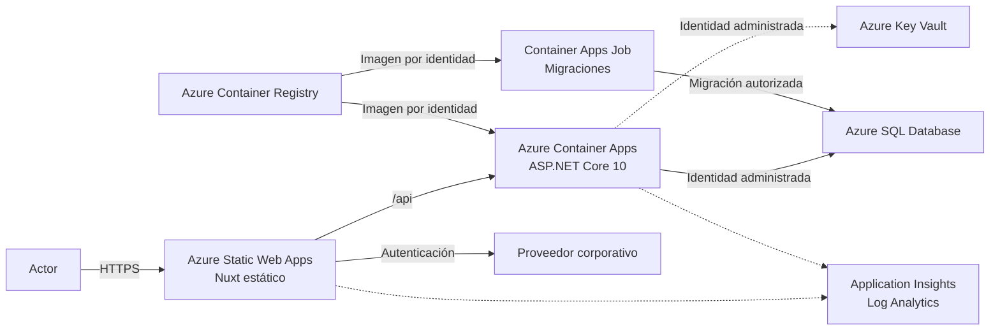

# Arauco Project Hub

## Architecture Decision Record

# ADR-008 - Plataforma y Estrategia de Despliegue

**Versión:** 1.0

**Estado:** Approved

**Fecha:** 2026-06-30

---

# 1. Contexto

Arauco Project Hub debe desplegar:

* Un Frontend con Nuxt 4.
* Una API y Backend con ASP.NET Core 10.
* Persistencia mediante Azure SQL Database.
* Observabilidad mediante Azure Monitor Application Insights y Log Analytics.

La restricción de plataforma establece:

* El Frontend debe utilizar Azure Static Web Apps.
* El Backend debe utilizar Azure Container Apps.
* Las imágenes del Backend deben almacenarse en Azure Container Registry.
* Azure App Service no debe utilizarse.

EST-005 exige construir una Versión una sola vez, promover artefactos inmutables entre Ambientes, separar configuración y credenciales, verificar cada Despliegue y contar con recuperación.

ADR-005 prefiere una sesión mediada por el servidor de Nuxt. Publicar el Frontend como contenido estático elimina ese servidor. Azure Static Web Apps puede administrar autenticación y enlazar una instancia de Azure Container Apps como Backend bajo `/api`, pero esta topología cambia la estrategia de sesión aprobada.

Por esta razón, ADR-005 debe revisarse antes de implementar autenticación y sesión.

---

# 2. Fuerzas de Decisión

La alternativa debe:

* Utilizar Azure Static Web Apps para el Frontend.
* Utilizar Azure Container Apps para el Backend.
* Utilizar Azure Container Registry como repositorio privado de imágenes.
* No utilizar Azure App Service.
* Mantener a Nuxt y ASP.NET Core como detalles tecnológicos.
* Mantener el Modelo de Dominio independiente de Azure.
* Separar Desarrollo, QAS y PRD.
* Mantener la identidad autenticada separada del Participante y sus permisos.
* Permitir que el Backend valide identidad y autorización.
* Utilizar imágenes inmutables.
* Evitar credenciales persistentes.
* Integrarse con Azure SQL Database y Azure Monitor.
* Mantener migraciones fuera del inicio del Backend.
* Permitir verificaciones de estado, promoción y reversión.
* Favorecer servicios administrados y una operación proporcional.

Los volúmenes, región, residencia, red, capacidad, disponibilidad y políticas corporativas permanecen Pendientes.

---

# 3. Opciones Consideradas

## 3.1 Static Web Apps y Container Apps enlazados

Publicar Nuxt como Frontend estático en Azure Static Web Apps y enlazar Azure Container Apps como Backend bajo `/api`.

### Ventajas

* Cumple las plataformas requeridas.
* Static Web Apps entrega el Frontend desde una plataforma administrada.
* Las solicitudes `/api` pueden enviarse al Backend enlazado sin configurar CORS.
* El Backend enlazado puede limitar por defecto el acceso a solicitudes que atraviesan Static Web Apps.
* Container Apps proporciona revisiones inmutables y verificaciones de preparación.
* El Backend escala y se despliega de forma independiente.
* Azure Container Registry mantiene las imágenes privadas.

### Desventajas

* Requiere el plan Standard de Static Web Apps.
* La integración enlaza una Container App con una Static Web App.
* Los entornos de pull request de Static Web Apps no admiten el Backend enlazado.
* El prefijo del Backend queda limitado a `/api`.
* Las solicitudes enlazadas admiten únicamente HTTP y tienen límites administrados por la plataforma.
* El Frontend estático no puede mediar la sesión mediante un servidor Nuxt.

## 3.2 Static Web Apps y Container Apps sin enlace administrado

Publicar el Frontend en Static Web Apps y llamar directamente al ingreso público de Container Apps.

### Ventajas

* No requiere la vinculación administrada.
* Permite probar Frontend y Backend de forma independiente.
* Evita el límite de una Container App enlazada por Static Web App.

### Desventajas

* Requiere administrar CORS y orígenes.
* Expone directamente el ingreso del Backend.
* La autenticación entre el Frontend y el Backend requiere más coordinación.
* Aumenta la superficie pública y los controles necesarios.

## 3.3 Static Web Apps con API administrada y Container Apps separado

Utilizar una API administrada por Static Web Apps como intermediario y mantener el Backend en Container Apps.

### Ventajas

* Permite agregar una capa de mediación.
* Puede adaptar identidad y contratos antes de invocar el Backend.

### Desventajas

* Introduce Azure Functions y una segunda API.
* Duplica responsabilidades de entrada y autenticación.
* Aumenta servicios, despliegues y observabilidad.
* No existe una necesidad aprobada que justifique esta capa.

## 3.4 Azure App Service

Ejecutar Frontend o Backend en Azure App Service.

Esta alternativa queda descartada porque contradice la restricción explícita de plataforma.

---

# 4. Decisión Propuesta

Se propone:

1. Utilizar Azure Static Web Apps para el Frontend.
2. Construir Nuxt 4 como aplicación estática de cliente.
3. No ejecutar un servidor Nuxt en Producción.
4. Utilizar Azure Container Apps para la API y el Backend.
5. Enlazar cada Static Web App con su Container App correspondiente.
6. Exponer las capacidades del Backend mediante el prefijo `/api`.
7. Utilizar el plan Standard de Azure Static Web Apps.
8. Utilizar Azure Container Registry como repositorio privado de imágenes del Backend y de migraciones.
9. Mantener una imagen inmutable del Backend por Versión.
10. Identificar imágenes mediante digest y una etiqueta derivada del commit.
11. No utilizar `latest` para una Versión desplegable.
12. Utilizar identidad administrada para que Container Apps obtenga imágenes desde Azure Container Registry.
13. Utilizar una identidad administrada distinta para que el Backend acceda a Azure SQL Database, Key Vault y otros servicios permitidos.
14. Utilizar Azure Key Vault para secretos que no puedan reemplazarse por identidad.
15. Utilizar identidad federada de GitHub Actions con Microsoft Entra ID.
16. Utilizar Bicep para definir la infraestructura.
17. Utilizar revisiones de Container Apps para preparar, verificar, activar y revertir el Backend.
18. Utilizar un Container Apps Job manual para ejecutar migraciones.
19. Mantener las migraciones fuera del inicio del Backend.
20. Separar los recursos de Desarrollo, QAS y PRD.
21. No utilizar Azure App Service.
22. No incorporar Kubernetes.

La estrategia de autenticación deberá resolverse mediante una nueva decisión que revise ADR-005 antes de implementarse.

---

# 5. Vista Propuesta

Static Web Apps será el único punto público utilizado por el Frontend para invocar la API en el flujo normal.

---

# 6. Frontend

El Frontend debe:

* Construirse con Nuxt 4 para alojamiento estático.
* Generar un artefacto estático inmutable.
* Mantener configuración específica del Ambiente fuera del código cuando la plataforma lo permita.
* Utilizar rutas `/api` para comunicarse con el Backend enlazado.
* No contener secretos.
* No acceder directamente a Azure SQL Database.
* Mantener las reglas del dominio en el Backend.
* Identificar el commit del que proviene.

La implementación debe validar si se utilizará:

* Generación estática con rutas prerenderizadas.
* Aplicación exclusivamente de cliente mediante `ssr: false`.

La alternativa seleccionada debe soportar las capacidades aprobadas sin requerir un servidor Nuxt.

---

# 7. Autenticación y Sesión

La topología propuesta no puede aplicar la sesión mediada por servidor Nuxt definida como preferida en ADR-005.

Se propone revisar ADR-005 para evaluar:

1. Autenticación integrada de Azure Static Web Apps con el proveedor corporativo.
2. Sesión administrada por Static Web Apps.
3. Propagación de la identidad hacia el Backend enlazado.
4. Validación de la identidad en Container Apps y en la API.
5. Relación del identificador estable con el Participante.
6. Cierre, expiración, renovación y revocación.
7. Protección frente a suplantación de encabezados.

La identidad entregada por la plataforma:

* No reemplaza al Participante.
* No concede permisos del dominio.
* Debe validarse antes de autorizar.
* No permite confiar en datos enviados libremente por el navegador.

No se implementará autenticación ni sesión hasta aprobar una alternativa compatible que revise ADR-005.

---

# 8. Backend Enlazado

Cada Azure Static Web App se enlazará con una Azure Container App.

La integración debe:

* Enviar solicitudes bajo `/api`.
* Restringir el acceso directo al Backend cuando la plataforma lo permita.
* Mantener HTTPS.
* Propagar únicamente información de identidad validada.
* Conservar correlación mediante W3C Trace Context.
* Mantener autenticación y autorización definitivas en el Backend.

Restricciones conocidas:

* Requiere Static Web Apps Standard.
* Una Container App se enlaza con una Static Web App.
* Los entornos de pull request no admiten este Backend enlazado.
* Solo se admiten solicitudes HTTP.
* Las solicitudes de API tienen un tiempo máximo administrado por Static Web Apps.
* Un Backend aislado completamente por red no puede utilizar esta vinculación.

Estas restricciones deben probarse con un flujo representativo antes de aprobar.

---

# 9. Imagen del Backend

La imagen del Backend debe:

* Utilizar una imagen base soportada para .NET 10.
* Construirse en múltiples etapas.
* Ejecutarse sin privilegios elevados.
* Contener solo los archivos necesarios.
* Definir usuario no root.
* Declarar puerto y comando de inicio.
* Incluir verificaciones de inicio y preparación en la configuración de Container Apps.
* No contener secretos.
* Analizarse antes de publicarse.
* Identificarse mediante digest y commit.

Las imágenes base deben fijarse de forma controlada y actualizarse conforme a EST-001.

---

# 10. Azure Container Registry

Azure Container Registry será la fuente oficial de imágenes desplegables.

El registro debe:

* Mantener acceso privado.
* Deshabilitar credenciales administrativas.
* Utilizar Microsoft Entra ID y menor privilegio.
* Separar permisos de publicación y lectura.
* Permitir a Container Apps obtener imágenes mediante identidad administrada.
* Evitar etiquetas mutables para Despliegues.
* Mantener retención y eliminación controladas.
* Conservar la imagen activa y las requeridas para reversión.

Se propone un registro compartido por el producto porque las imágenes son artefactos independientes del Ambiente.

Cada Ambiente tendrá una identidad de lectura propia. Solo la automatización autorizada tendrá permisos de publicación.

La necesidad de registros separados deberá revisarse si una política corporativa exige aislamiento físico por Ambiente.

---

# 11. Organización por Ambiente

Cada Ambiente debe tener:

* Una Azure Static Web App.
* Un Azure Container Apps Environment.
* Una Azure Container App para el Backend.
* Un Container Apps Job para migraciones.
* Identidades y configuración propias.
* Recursos de persistencia y observabilidad separados conforme a los ADR.

Azure Container Registry puede compartirse porque almacena artefactos inmutables y no configuración ni datos operacionales.

No se compartirán secretos, datos, identidades de ejecución ni configuración entre Ambientes.

---

# 12. Configuración y Secretos

El Frontend estático solo puede recibir configuración pública.

Ningún valor incluido en el artefacto del Frontend se considera secreto.

El Backend debe:

* Utilizar variables de entorno para configuración no sensible.
* Utilizar referencias de Azure Key Vault para secretos.
* Acceder a Key Vault mediante identidad administrada.
* Acceder directamente mediante identidad cuando el servicio lo admita.
* Evitar cadenas de conexión con credenciales cuando Azure SQL Database permita Microsoft Entra ID.

La rotación no debe requerir reconstruir la imagen.

---

# 13. Identidades

Se deben separar:

* Identidad para publicar imágenes.
* Identidad para desplegar infraestructura.
* Identidad para obtener imágenes.
* Identidad de ejecución del Backend.
* Identidad del Job de migraciones.
* Identidad del actor autenticado.

GitHub Actions utilizará federación con Microsoft Entra ID.

Container Apps utilizará una identidad con permiso exclusivo de lectura sobre Azure Container Registry.

El Backend y el Job de migraciones tendrán permisos diferentes sobre Azure SQL Database.

---

# 14. Estrategia de Despliegue

## 14.1 Frontend

El artefacto estático:

1. Se construye una vez.
2. Se valida.
3. Se promueve a la Static Web App de cada Ambiente.
4. Se verifica mediante rutas y capacidades representativas.
5. Conserva referencia al commit.

La automatización debe desplegar la salida preconstruida sin reconstruirla durante cada promoción.

## 14.2 Backend

La imagen:

1. Se construye una vez.
2. Se analiza.
3. Se publica en Azure Container Registry.
4. Se identifica por digest.
5. Se despliega como nueva revisión.
6. Ejecuta verificaciones de inicio y preparación.
7. Se valida antes de recibir tráfico.
8. Se promueve mediante control de tráfico.

PRD requiere aprobación explícita.

No se utilizarán capacidades en preview para el flujo inicial de promoción.

---

# 15. Revisiones y Reversión

Container Apps utilizará múltiples revisiones en PRD.

Una nueva revisión:

* Inicia sin recibir el tráfico principal.
* Se verifica mediante su acceso controlado.
* Recibe el tráfico únicamente después de aprobarse.
* Mantiene disponible la revisión anterior durante la ventana de validación.

La reversión consiste en devolver el tráfico a la revisión anterior cuando:

* La imagen anterior sigue disponible.
* Los contratos permanecen compatibles.
* Las migraciones no impiden volver.

La reversión del Frontend debe promover nuevamente el artefacto estático anterior.

Una reversión de código no revierte datos automáticamente.

---

# 16. Migraciones

Las migraciones se ejecutarán mediante un Container Apps Job manual.

El Job:

* Utilizará una imagen inmutable almacenada en Azure Container Registry.
* Contendrá el bundle de migraciones de Entity Framework Core.
* Tendrá identidad propia.
* Tendrá permisos mínimos sobre Azure SQL Database.
* Se ejecutará de forma explícita y autorizada.
* No se ejecutará en paralelo para una misma base de datos.
* Registrará Versión, resultado y duración.
* Finalizará después de aplicar o rechazar la migración.

Antes de ejecutar:

1. Revisar la migración.
2. Confirmar compatibilidad con la revisión vigente y la nueva.
3. Verificar respaldo y recuperación.
4. Definir el tratamiento de fallo.

El Backend no aplicará migraciones durante su inicio.

---

# 17. Infraestructura como Código

La infraestructura se definirá mediante Bicep.

Debe incluir:

* Static Web Apps.
* Container Apps Environments.
* Container Apps.
* Container Apps Jobs.
* Azure Container Registry.
* Identidades y asignaciones.
* Azure Key Vault.
* Vinculación entre Static Web Apps y Container Apps.
* Configuración de observabilidad.

Los cambios manuales no trazables no constituyen el mecanismo normal de administración.

Los parámetros se separarán por Ambiente y no contendrán secretos.

---

# 18. Observabilidad

El Backend debe:

* Utilizar OpenTelemetry y Azure Monitor conforme a ADR-007.
* Identificar revisión, digest, Versión y Ambiente.
* Exponer verificaciones de inicio, preparación y estado.
* Correlacionar solicitudes provenientes de Static Web Apps.
* Observar Azure SQL Database y el Job de migraciones.

El Frontend utilizará el SDK JavaScript de Application Insights conforme a ADR-007.

Las señales no reemplazan el Historial.

---

# 19. Seguridad

La implementación debe:

* Mantener HTTPS.
* Restringir el Backend al flujo enlazado cuando sea compatible.
* Validar identidad en la API.
* Aplicar autorización contextual por Iniciativa.
* Evitar confiar en encabezados enviados directamente por el navegador.
* Mantener secretos en Key Vault.
* Usar identidades administradas.
* Escanear imágenes.
* Ejecutar contenedores sin privilegios.
* Limitar CPU, memoria y escalamiento.
* Separar permisos por Ambiente.

La autenticación integrada de Static Web Apps no reemplaza SRS-007.

---

# 20. Consecuencias

## 20.1 Positivas

* Cumple la plataforma requerida.
* El Frontend se distribuye como contenido estático administrado.
* El Backend utiliza revisiones inmutables.
* Azure Container Registry conserva imágenes privadas y trazables.
* Static Web Apps puede enlazar el Backend bajo un mismo origen.
* Container Apps puede obtener imágenes y acceder a Azure mediante identidad.
* El Job de migraciones separa cambios de esquema del inicio del Backend.
* No se utiliza Azure App Service.
* No se introduce Kubernetes.

## 20.2 Costos y Restricciones

* Static Web Apps requiere el plan Standard para enlazar Container Apps.
* El Frontend pierde el servidor Nuxt.
* ADR-005 debe revisarse.
* Los entornos de pull request no pueden usar el Backend enlazado.
* Se deben construir, analizar y mantener imágenes.
* Se incorpora Azure Container Registry.
* La promoción requiere coordinar artefacto estático, imagen, revisión y migraciones.
* El Backend enlazado no puede estar aislado completamente por red.

## 20.3 Riesgos

### Identidad no validada

El Backend podría confiar en encabezados sin verificar su origen.

Mitigación:

* Restringir acceso al enlace administrado.
* Validar la configuración de autenticación.
* Probar solicitudes directas y encabezados manipulados.

### Incompatibilidad con Nuxt 4

La documentación oficial específica de Static Web Apps describe Nuxt 3.

Mitigación:

* Utilizar salida estática estándar de Nuxt 4.
* Ejecutar una prueba técnica antes de aprobar.
* Evitar depender de conversión administrada a Azure Functions.

### Reversión bloqueada por migración

Una migración incompatible puede impedir volver a la revisión anterior.

Mitigación:

* Preferir cambios compatibles.
* Separar cambios de esquema y uso.
* Verificar recuperación.

### Imágenes vulnerables

Una imagen base puede incorporar vulnerabilidades.

Mitigación:

* Fijar versiones.
* Escanear imágenes.
* Reconstruir ante actualizaciones de seguridad.

---

# 21. Criterios de Cumplimiento

La implementación cumple cuando:

* Utiliza Azure Static Web Apps para el Frontend.
* Utiliza Azure Container Apps para el Backend.
* Utiliza Azure Container Registry.
* No utiliza Azure App Service.
* Publica Nuxt como artefacto estático.
* Enlaza Static Web Apps y Container Apps bajo `/api`.
* Mantiene una imagen inmutable identificada por digest.
* Utiliza identidades administradas para obtener imágenes y acceder a Azure.
* Mantiene secretos en Key Vault.
* Utiliza federación para GitHub Actions.
* Mantiene infraestructura mediante Bicep.
* Usa revisiones para promoción y reversión.
* Ejecuta migraciones mediante un Container Apps Job.
* No ejecuta migraciones al iniciar el Backend.
* Separa recursos y permisos por Ambiente.
* Mantiene observabilidad conforme a ADR-007.
* Mantiene el Modelo de Dominio independiente de la plataforma.
* Exige revisar ADR-005 antes de implementar autenticación y sesión.

---

# 22. Cuándo Revisar

Esta decisión deberá revisarse si:

* Static Web Apps no soporta las capacidades requeridas de Nuxt 4.
* El Backend enlazado no permite cumplir autenticación o red.
* Las solicitudes requieren protocolos o duraciones no soportados.
* Los entornos de pull request necesitan un Backend completo.
* Azure Container Apps o Azure Container Registry no están permitidos.
* Los objetivos de disponibilidad o recuperación no pueden alcanzarse.
* Los costos no son proporcionales.
* Se requiere más de un Backend enlazado por Frontend.

---

# 23. Trazabilidad

Este ADR deriva principalmente de:

* PHIL-001: FP-005, FP-009, FP-011 y FP-012.
* SRS-006: RNF-003, RNF-006, RNF-012 a RNF-019 y RNF-038 a RNF-048.
* ADR-003 - Frontend con Nuxt 4.
* ADR-004 - Backend con .NET 10.
* ADR-005 - Proveedor de Identidad y Estrategia de Sesión.
* ADR-006 - Tecnología y Estrategia de Persistencia.
* ADR-007 - Plataforma y Estándar de Observabilidad.
* EST-001 - Estándar Tecnológico.
* EST-002 - Estándar Azure.
* EST-003 - Convención de Repositorios.
* EST-004 - Convención de Nombres.
* EST-005 - CI/CD.

---

# 24. Fuentes Técnicas Consultadas

* [Azure Static Web Apps con Azure Container Apps](https://learn.microsoft.com/en-us/azure/static-web-apps/apis-container-apps).
* [Soporte de API en Azure Static Web Apps](https://learn.microsoft.com/en-us/azure/static-web-apps/apis-overview).
* [Autenticación en Azure Static Web Apps](https://learn.microsoft.com/en-us/azure/static-web-apps/add-authentication).
* [Información de actores en Azure Static Web Apps](https://learn.microsoft.com/en-us/azure/static-web-apps/user-information).
* [Despliegue de Nuxt en Azure Static Web Apps](https://learn.microsoft.com/en-us/azure/static-web-apps/deploy-nuxtjs).
* [Despliegue de Nuxt 4](https://nuxt.com/docs/4.x/getting-started/deployment).
* [Revisiones en Azure Container Apps](https://learn.microsoft.com/en-us/azure/container-apps/revisions).
* [Identidades administradas en Azure Container Apps](https://learn.microsoft.com/en-us/azure/container-apps/managed-identity).
* [Secretos en Azure Container Apps](https://learn.microsoft.com/en-us/azure/container-apps/manage-secrets).
* [Jobs en Azure Container Apps](https://learn.microsoft.com/en-us/azure/container-apps/jobs).
* [Identidad administrada con Azure Container Registry](https://learn.microsoft.com/en-us/azure/container-registry/container-registry-authentication-managed-identity).
* [Aplicación de migraciones de Entity Framework Core](https://learn.microsoft.com/en-us/ef/core/managing-schemas/migrations/applying).
* [Documentación de Bicep](https://learn.microsoft.com/en-us/azure/azure-resource-manager/bicep/).

Las fuentes técnicas respaldan las capacidades y restricciones actuales. La decisión se fundamenta en los documentos Approved de Arauco Project Hub y en la restricción de plataforma indicada.

---

# 25. Validaciones de Implementación

* Revisar ADR-005 y aprobar una estrategia de autenticación compatible con Frontend estático.
* Confirmar Azure Static Web Apps Standard, Azure Container Apps, Azure Container Registry, Key Vault y Bicep como plataformas permitidas.
* Probar Nuxt 4 como artefacto estático.
* Seleccionar generación estática o aplicación exclusivamente de cliente.
* Probar autenticación corporativa en Static Web Apps.
* Verificar la identidad propagada al Backend enlazado.
* Probar rechazo de acceso directo y encabezados manipulados.
* Validar el límite `/api`, duración de solicitudes y ausencia de WebSocket.
* Definir una estrategia para pruebas de pull request sin Backend enlazado.
* Confirmar región, residencia y red.
* Validar conectividad e identidad hacia Azure SQL Database.
* Definir CPU, memoria, réplicas y reglas de escalamiento.
* Validar análisis, retención y recuperación de imágenes.
* Probar promoción y reversión de revisiones.
* Probar el Job de migraciones.
* Validar disponibilidad, recuperación y costo.

---

# 26. Decisiones Posteriores

Este ADR deberá orientar:

* Revisión de ADR-005.
* Estructura de infraestructura.
* Implementación de Bicep.
* Dockerfile del Backend.
* Construcción y publicación en Azure Container Registry.
* Workflows de Static Web Apps y Container Apps.
* Configuración de autenticación.
* Pruebas de estado y preparación.
* Procedimiento de migraciones.
* Procedimiento de Despliegue y reversión.

---

# 27. Siguiente Paso

Después de aprobar ADR-008, el siguiente documento propuesto es:

ADR-009 - Autenticación y Sesión para Frontend Estático.

Objetivo:

Revisar y superseder la estrategia de sesión mediada por servidor Nuxt definida en ADR-005, utilizando una alternativa compatible con Azure Static Web Apps y el Backend enlazado en Azure Container Apps.

En paralelo, ejecutar una prueba técnica acotada de:

* Nuxt 4 estático en Azure Static Web Apps.
* Backend mínimo enlazado en Azure Container Apps.
* Propagación y validación de identidad.

---

# 28. Estado del Documento

**Estado actual:** Approved

Este documento constituye la fuente oficial para la plataforma y estrategia de Despliegue de Arauco Project Hub.
