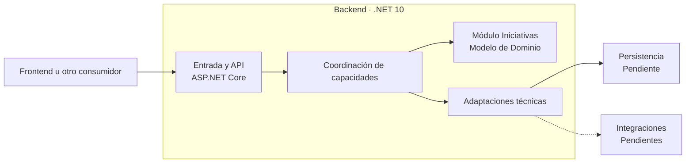
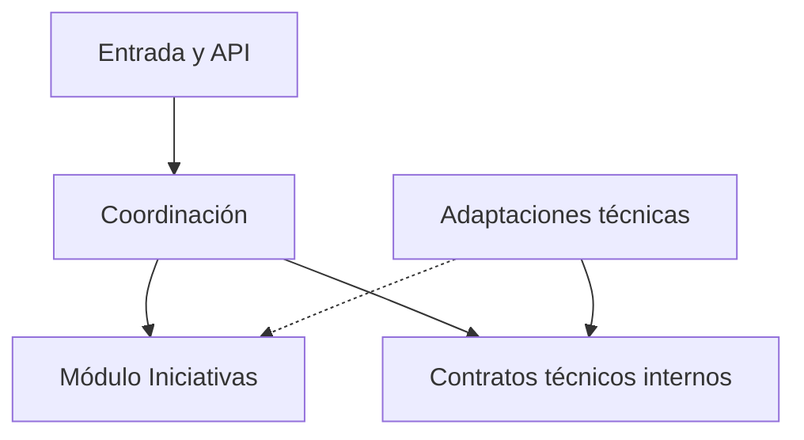

# Arauco Project Hub

## Engineering Playbook

# Arquitectura del Backend

**Versión:** 1.0

**Estado:** Approved

**Fecha:** 2026-06-28

---

# 1. Objetivo

Este documento define la arquitectura interna inicial del Backend de Arauco Project Hub.

Su propósito es establecer cómo .NET 10, C# y ASP.NET Core 10 coordinan la API, las capacidades del módulo Iniciativas, el Modelo de Dominio, la persistencia y las integraciones sin trasladar reglas del dominio a detalles tecnológicos.

Esta arquitectura deriva de los SRS, ADR y documentos de arquitectura aprobados. No incorpora conceptos nuevos al dominio.

---

# 2. Alcance

Este documento establece:

* Las responsabilidades internas del Backend.
* La dirección de las dependencias.
* El flujo general de una solicitud.
* La separación entre contratos externos, coordinación, dominio y adaptaciones técnicas.
* Los límites para persistencia e integraciones.
* La estrategia general de validación, errores, trazabilidad y pruebas.

Quedan fuera del alcance:

* La estructura física definitiva de proyectos y carpetas.
* Controllers o Minimal APIs.
* El diseño detallado de endpoints.
* La tecnología y estrategia concreta de persistencia.
* El motor de base de datos.
* La autenticación y autorización.
* La mensajería.
* La observabilidad detallada.
* La infraestructura y el despliegue.
* Los requerimientos no funcionales todavía no aprobados.

---

# 3. Restricciones Aprobadas

El Backend debe:

* Utilizar .NET 10, C# y ASP.NET Core 10.
* Formar parte del monorepo.
* Mantener un único módulo de dominio denominado Iniciativas.
* Mantener a la Iniciativa como Aggregate Root principal.
* Utilizar el Lenguaje Ubicuo.
* Mantener las reglas del dominio independientes de ASP.NET Core.
* Utilizar contratos de API explícitos.
* No exponer directamente entidades del dominio ni estructuras de persistencia.
* Adaptar persistencia e integraciones al dominio.
* Conservar trazabilidad de acciones y decisiones relevantes.

---

# 4. Principios

## 4.1 Dependencias hacia el dominio

Las responsabilidades externas dependen de contratos y capacidades internas.

El dominio no depende de la API, ASP.NET Core, persistencia, integraciones ni infraestructura.

## 4.2 Una responsabilidad por límite

Cada límite debe tener una responsabilidad reconocible:

* La API recibe y responde.
* La coordinación ejecuta una capacidad.
* El dominio aplica reglas.
* La persistencia conserva estado.
* Las integraciones adaptan servicios externos.

## 4.3 Contratos separados

Los contratos externos no son entidades del dominio ni estructuras relacionales.

La traducción entre contratos y dominio ocurre en los límites del Backend.

## 4.4 Reglas en el dominio

Una validación que depende del significado de Iniciativa, Solicitud, Participante, Estado o cualquier otro concepto aprobado pertenece al dominio o a su coordinación.

No debe depender únicamente de atributos del framework o restricciones de persistencia.

## 4.5 Simplicidad inicial

La arquitectura incorpora únicamente los límites necesarios para proteger el dominio.

No se adoptan patrones, bibliotecas o procesos distribuidos sin una necesidad validada.

---

# 5. Vista General

Las dependencias de implementación deben preservar que el dominio no conozca los límites externos.

---

# 6. Entrada y API

## 6.1 Responsabilidades

La entrada y API debe:

* Recibir solicitudes externas.
* Validar la forma del contrato.
* Identificar la capacidad solicitada.
* Traducir el contrato externo hacia una solicitud interna.
* Invocar la coordinación correspondiente.
* Traducir el resultado hacia un contrato de respuesta.
* Aplicar el manejo uniforme de errores.

## 6.2 Lo que no debe hacer

La entrada y API no debe:

* Implementar las reglas principales del dominio.
* Acceder directamente a la persistencia.
* Exponer entidades del dominio.
* Exponer estructuras del Modelo Relacional.
* Coordinar múltiples capacidades sin un límite explícito.
* Determinar estados o transiciones no aprobados.

## 6.3 Contratos

Los contratos deben:

* Utilizar el Lenguaje Ubicuo cuando representen conceptos del dominio.
* Ser explícitos respecto de datos obligatorios y opcionales.
* Evitar campos técnicos que existan solo por conveniencia de persistencia.
* Mantener separados los contratos de entrada y salida cuando sus responsabilidades sean distintas.
* Evolucionar de manera controlada.

El estilo de endpoints, versionado y formato definitivo de errores permanecen Pendientes.

---

# 7. Coordinación de Capacidades

## 7.1 Propósito

La coordinación conecta una solicitud externa con el comportamiento del módulo Iniciativas.

## 7.2 Responsabilidades

Debe:

* Representar una intención reconocible del producto.
* Obtener el contexto requerido.
* Identificar al Participante responsable cuando corresponda.
* Invocar operaciones del dominio.
* Coordinar persistencia e integraciones mediante contratos.
* Confirmar el resultado completo o informar el error.
* Conservar la información necesaria para trazabilidad.

## 7.3 Límites

La coordinación no debe:

* Duplicar reglas que pertenecen al dominio.
* Depender de clases concretas de persistencia.
* Devolver entidades del dominio directamente a la API.
* Introducir conceptos que no estén respaldados por el Lenguaje Ubicuo.

## 7.4 Escrituras y Consultas

Las operaciones que modifican estado deben:

* Recuperar el contexto necesario de la Iniciativa.
* Aplicar reglas antes de persistir.
* Mantener consistencia entre el cambio y su Historial.
* Evitar cambios parciales.

Las operaciones de consulta deben:

* Presentar información sin modificar el dominio.
* Mantener el contexto de la Iniciativa.
* Evitar exponer la estructura física de persistencia.

Este documento no exige CQRS ni modelos de lectura independientes.

---

# 8. Módulo Iniciativas

El módulo Iniciativas contiene el Modelo de Dominio y sus reglas.

## 8.1 Responsabilidades

Debe:

* Mantener a la Iniciativa como Aggregate Root principal.
* Representar entidades y Objetos de Valor.
* Proteger las reglas RD-001 a RD-010.
* Aplicar las reglas operacionales RO-001 a RO-015 según su alcance.
* Mantener separados el Estado de Iniciativa y el Estado de Solicitud.
* Producir la información necesaria para eventos del Historial.
* Impedir valores no gobernados.

## 8.2 Dependencias

Puede depender de:

* Tipos propios del dominio.
* Contratos mínimos sin detalles tecnológicos cuando sean indispensables.

No depende de:

* ASP.NET Core.
* Contratos externos de la API.
* Entity Framework Core u otra tecnología de persistencia.
* Servicios externos.
* Configuración de infraestructura.

## 8.3 Pendientes heredados

La implementación no debe resolver por supuesto:

* Ambiente como entidad u Objeto de Valor.
* El catálogo de eventos.
* Las transiciones completas de Estado de Iniciativa.
* Los Estados de Recurso.
* Los valores de Resultado de Despliegue.
* La relación entre Solicitudes y Versiones.
* El concepto Solución dentro del modelo.

Estos puntos requieren revisar primero el documento de mayor prioridad correspondiente.

---

# 9. Adaptaciones Técnicas

## 9.1 Propósito

Las adaptaciones técnicas conectan la coordinación con persistencia, integraciones y otros mecanismos externos.

## 9.2 Reglas

Las adaptaciones:

* Implementan contratos definidos desde las necesidades internas.
* Traducen modelos técnicos hacia representaciones internas y viceversa.
* No contienen reglas principales del dominio.
* No exponen detalles técnicos hacia el dominio.
* Pueden sustituirse sin redefinir conceptos del producto.

## 9.3 Persistencia

La adaptación de persistencia debe:

* Aplicar el Modelo Relacional aprobado.
* Reconstruir el estado válido requerido por el dominio.
* Conservar identidades y relaciones.
* Mantener integridad referencial.
* Persistir el cambio y la trazabilidad de forma consistente.
* Evitar que entidades de persistencia se filtren hacia la API.

La tecnología, ORM, estrategia de carga y transacciones permanecen Pendientes.

## 9.4 Integraciones

Cada integración futura debe:

* Adaptar sus términos al Lenguaje Ubicuo.
* Definir un contrato explícito.
* Manejar indisponibilidad y errores sin corromper el dominio.
* Conservar trazabilidad cuando la interacción sea relevante.

Las integraciones específicas permanecen Pendientes.

---

# 10. Dirección de Dependencias

Reglas:

* La API depende de la coordinación.
* La coordinación depende del dominio y de contratos internos.
* Las adaptaciones implementan contratos internos.
* El dominio no depende de la API ni de adaptaciones.
* Ninguna dependencia circular está permitida entre estos límites.

La estructura física que materialice estas dependencias se definirá posteriormente.

---

# 11. Flujo de una Solicitud

## 11.1 Cambio de Estado

Un cambio de Estado de Iniciativa sigue este flujo:

1. La API recibe el contrato.
2. Se valida su forma.
3. La coordinación identifica la Iniciativa y al Participante responsable.
4. La persistencia recupera el contexto requerido.
5. El dominio valida la transición y sus reglas aprobadas.
6. La Iniciativa aplica el nuevo estado.
7. Se produce la información requerida para el Historial.
8. La persistencia conserva el cambio y la trazabilidad de forma consistente.
9. La coordinación construye el resultado.
10. La API devuelve el contrato de respuesta.

## 11.2 Consulta

Una consulta sigue este flujo:

1. La API recibe los criterios.
2. La coordinación valida el contexto permitido.
3. La adaptación de persistencia recupera la información.
4. La coordinación construye una representación de salida.
5. La API devuelve el contrato sin exponer estructuras internas.

La optimización de consultas y los modelos de lectura permanecen Pendientes.

---

# 12. Consistencia y Transacciones

Una operación que modifica una Iniciativa debe conservar consistencia entre:

* El estado del Aggregate.
* Las entidades relacionadas modificadas.
* El evento del Historial correspondiente.

La operación no debe dejar cambios parciales visibles.

La tecnología y mecanismo concreto de transacción permanecen Pendientes y deberán definirse junto con la persistencia.

Las integraciones externas no deben incluirse automáticamente en la misma transacción. Su coordinación requerirá una decisión específica cuando exista una integración aprobada.

---

# 13. Validación

La validación se distribuye por responsabilidad:

## 13.1 Contrato Externo

Verifica:

* Forma.
* Presencia de datos obligatorios.
* Formatos básicos.

## 13.2 Coordinación

Verifica:

* Existencia del contexto requerido.
* Disponibilidad de dependencias.
* Identidad del actor cuando corresponda.

## 13.3 Dominio

Verifica:

* Reglas e invariantes.
* Estados y valores gobernados.
* Transiciones permitidas.
* Pertenencia al contexto de la Iniciativa.

Una validación externa puede mejorar la respuesta, pero no reemplaza la protección del dominio.

---

# 14. Manejo de Errores

El Backend debe distinguir, al menos conceptualmente:

* Contrato inválido.
* Regla del dominio incumplida.
* Información no encontrada.
* Acción no permitida.
* Conflicto con el estado vigente.
* Fallo técnico.

La API debe traducir cada resultado sin exponer:

* Excepciones internas.
* Detalles de persistencia.
* Información sensible.
* Trazas técnicas.

El formato de error y su correspondencia con protocolos permanecen Pendientes.

---

# 15. Trazabilidad

El Backend debe conservar:

* La Iniciativa afectada.
* La acción realizada.
* La fecha.
* El Participante responsable cuando corresponda.
* El estado anterior y nuevo cuando corresponda.
* La Solicitud relacionada cuando corresponda.
* El fundamento mediante Conversación cuando la regla lo exige.

El Historial registra eventos del producto. Los registros técnicos de observabilidad cumplen una responsabilidad distinta y se definirán posteriormente.

---

# 16. Seguridad

Hasta que se apruebe la arquitectura de seguridad, el Backend debe:

* Evitar confiar únicamente en validaciones del Frontend.
* Mantener separados autenticación, autorización y reglas del dominio.
* No exponer información interna en respuestas de error.
* Validar datos recibidos en sus límites.
* Preparar contratos que permitan identificar al actor responsable.

El proveedor de identidad, los permisos y las políticas específicas permanecen Pendientes.

---

# 17. Pruebas

La estrategia del Backend debe permitir:

## 17.1 Pruebas del Dominio

* Ejecutar sin ASP.NET Core, persistencia ni servicios externos.
* Verificar reglas, estados y Objetos de Valor.
* Verificar la información producida para Historial.

## 17.2 Pruebas de Coordinación

* Verificar cada capacidad con dependencias controladas.
* Verificar traducción de resultados y errores.
* Verificar que no se persistan cambios inválidos.

## 17.3 Pruebas de Adaptaciones

* Verificar el contrato de persistencia.
* Verificar integridad y traducción de datos.
* Verificar comportamiento ante fallos externos.

## 17.4 Pruebas de API

* Verificar contratos.
* Verificar validación y manejo de errores.
* Verificar el flujo integrado del Backend.

La selección de bibliotecas y alcance cuantitativo de cobertura permanecen Pendientes.

---

# 18. Estructura Física

La estructura física deberá:

* Mantener visible el módulo Iniciativas.
* Hacer explícita la dirección de dependencias.
* Permitir probar el dominio sin infraestructura.
* Evitar carpetas genéricas que mezclen responsabilidades.
* Mantener separadas API, coordinación, dominio y adaptaciones.

La cantidad de proyectos .NET, sus nombres y su organización requieren una decisión posterior. Si esa decisión introduce complejidad o un patrón arquitectónico específico, deberá documentarse mediante ADR.

---

# 19. Criterios de Cumplimiento

La implementación cumple este documento cuando:

* Utiliza .NET 10, C# y ASP.NET Core 10.
* Mantiene la API separada del Modelo de Dominio.
* Coordina capacidades sin duplicar reglas del dominio.
* Mantiene el módulo Iniciativas independiente de frameworks.
* Utiliza contratos internos para persistencia e integraciones.
* No expone entidades del dominio ni estructuras relacionales.
* Conserva consistencia entre cambios e Historial.
* Permite pruebas del dominio sin infraestructura.
* No resuelve Pendientes mediante supuestos técnicos.
* Mantiene dependencias explícitas y sin ciclos.

---

# 20. Trade-offs

## 20.1 Ventajas

* Protege el dominio frente a cambios tecnológicos.
* Mantiene responsabilidades reconocibles.
* Facilita pruebas sin infraestructura.
* Permite sustituir persistencia e integraciones.
* Mantiene trazabilidad entre capacidades y reglas.

## 20.2 Costos

* Requiere traducción entre contratos externos, dominio y persistencia.
* Introduce límites internos que deben mantenerse.
* Exige disciplina para no duplicar modelos y reglas innecesariamente.

## 20.3 Aspectos a Revisar

* Tamaño y carga del Aggregate.
* Cantidad de proyectos .NET.
* Estrategia de persistencia.
* Diseño de API.
* Transacciones e integraciones.
* Requerimientos no funcionales.

---

# 21. Trazabilidad Documental

Este documento deriva principalmente de:

* PHIL-001.
* SRS-002 - Lenguaje Ubicuo.
* SRS-003 - Modelo de Dominio.
* SRS-004 - Modelo Operacional.
* SRS-010 - Modelo Relacional.
* ADR-001 - Arquitectura Basada en el Negocio.
* ADR-002 - Monorepo.
* ADR-004 - Backend con .NET 10.
* Visión de Arquitectura.
* Módulos.
* Modelo de Dominio Arquitectónico.
* DER.
* Diccionario de Datos.

---

# 22. Pendientes

* Definir Controllers o Minimal APIs.
* Definir el diseño y versionado de la API.
* Definir el formato de errores.
* Definir la tecnología y estrategia de persistencia.
* Definir la estrategia de reconstrucción del Aggregate.
* Definir transacciones.
* Definir autenticación y autorización.
* Definir observabilidad.
* Definir integraciones específicas.
* Definir la estructura física de proyectos .NET.
* Definir la estrategia detallada de pruebas.
* Aprobar requerimientos no funcionales.

Cada decisión arquitectónica importante deberá documentarse mediante ADR.

---

# 23. Estado del Documento

**Estado actual:** Approved

Este documento constituye la fuente oficial para la arquitectura interna del Backend de Arauco Project Hub.
