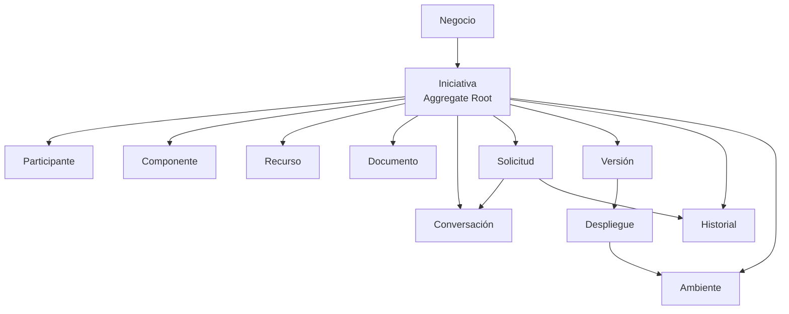
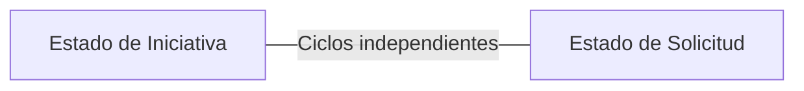

# Arauco Project Hub

## Engineering Playbook

# Modelo de Dominio Arquitectónico

**Versión:** 1.0

**Estado:** Approved

**Fecha:** 2026-06-28

---

# 1. Objetivo

Este documento define cómo se expresa arquitectónicamente el Modelo de Dominio aprobado dentro del módulo Iniciativas.

Su propósito es preservar a la Iniciativa como Aggregate Root principal, mantener explícitas las entidades, Objetos de Valor y reglas del dominio, y evitar que el framework, la API o la persistencia definan el modelo.

Este documento deriva de SRS-003. No reemplaza ese SRS ni incorpora conceptos, reglas o valores nuevos.

---

# 2. Alcance

Este documento establece:

* El límite del Aggregate.
* Las responsabilidades de la Iniciativa.
* La representación arquitectónica de entidades y Objetos de Valor.
* La aplicación de reglas del dominio.
* La relación entre cambios de estado, eventos e Historial.
* Las dependencias permitidas del dominio.
* Los criterios para mantener la coherencia del modelo.

Quedan fuera del alcance:

* La definición de atributos no aprobados.
* El catálogo de eventos del dominio.
* El diseño de la API.
* La arquitectura interna completa del Backend.
* La tecnología y estrategia de persistencia.
* La autenticación y autorización.
* El diseño de repositorios o acceso a datos.
* La implementación en C#.

---

# 3. Principios

## 3.1 El Modelo de Dominio es la fuente

Las entidades, relaciones y reglas se originan en SRS-003 y SRS-004.

Las clases, tablas, endpoints o componentes visuales no pueden redefinir el significado del dominio.

## 3.2 La Iniciativa protege la consistencia

Los cambios que afectan el contexto de una Iniciativa deben respetar sus reglas y mantener su trazabilidad.

La implementación no debe permitir modificaciones que eviten las validaciones del Aggregate Root.

## 3.3 Las reglas son explícitas

Las reglas del dominio deben expresarse mediante comportamiento y tipos del dominio.

No deben depender únicamente de validaciones del Frontend, endpoints, restricciones de base de datos o configuración libre.

## 3.4 Los Objetos de Valor están gobernados

Los estados, tipos, prioridades, roles y Ambientes definidos por el dominio no son textos libres.

Su representación debe impedir valores no aprobados.

## 3.5 La persistencia es una adaptación

El Modelo Relacional representa el dominio para persistirlo, pero no determina la forma ni el comportamiento de las entidades.

## 3.6 La trazabilidad forma parte del comportamiento

Una acción relevante debe producir la información necesaria para registrar un evento del Historial.

La trazabilidad no depende únicamente de comentarios manuales.

---

# 4. Límite del Aggregate

La Iniciativa es el Aggregate Root principal del módulo Iniciativas.

El contexto aprobado incluye:

* Negocio asociado.
* Participantes.
* Componentes.
* Recursos.
* Documentos.
* Conversaciones.
* Solicitudes.
* Versiones.
* Despliegues.
* Historial.
* Ambientes requeridos.

El diagrama representa relaciones conceptuales. No determina la carga completa del Aggregate, la estructura física de clases ni la estrategia de persistencia.

---

# 5. Aggregate Root Iniciativa

## 5.1 Responsabilidades

La Iniciativa debe:

* Mantener su identidad.
* Mantener su Negocio.
* Mantener un único Estado de Iniciativa vigente.
* Proteger las reglas para cambios de etapa.
* Coordinar la incorporación y modificación de entidades relacionadas.
* Mantener la independencia entre Estado de Iniciativa y Estado de Solicitud.
* Conservar la continuidad entre Producción y Operación.
* Producir la información necesaria para la trazabilidad.

## 5.2 Creación

La creación de una Iniciativa debe garantizar:

* Identidad.
* Negocio.
* Nombre.
* Objetivo.
* Estado de Iniciativa inicial válido.
* Fecha de creación.
* Condiciones de responsabilidad exigidas por el dominio cuando corresponda.

El Estado de Iniciativa inicial definitivo deberá mantenerse coherente con el Modelo Operacional aprobado.

## 5.3 Modificación

Las modificaciones deben realizarse mediante operaciones que expresen su intención.

La implementación debe evitar:

* Modificar libremente el Estado de Iniciativa.
* Reemplazar colecciones internas sin validar sus reglas.
* Asociar una entidad perteneciente a otra Iniciativa.
* Eliminar información necesaria para trazabilidad.
* Actualizar el estado sin registrar la responsabilidad involucrada.

## 5.4 Cierre y Cancelación

Cerrar o cancelar una Iniciativa:

* Cambia su Estado de Iniciativa conforme a reglas aprobadas.
* Conserva Documentos, Conversaciones e Historial.
* Conserva el fundamento y la responsabilidad de la decisión.
* No elimina el contexto acumulado.

Los criterios organizacionales para cerrar una Iniciativa permanecen Pendientes.

---

# 6. Entidades

Una entidad:

* Tiene identidad propia dentro del contexto correspondiente.
* Mantiene continuidad aunque cambien sus datos.
* No se compara únicamente por sus atributos.
* Se modifica mediante operaciones que protegen las reglas aplicables.

## 6.1 Participante

Representa la participación de una persona o equipo dentro de una Iniciativa.

Debe:

* Pertenecer a una Iniciativa.
* Mantener un Rol de Participación válido.
* Conservar la identificación de la persona o equipo.

La integración con una fuente corporativa de personas permanece Pendiente.

## 6.2 Componente

Representa un elemento técnico de una Iniciativa.

Debe:

* Pertenecer a una Iniciativa.
* Utilizar un Tipo de Componente gobernado.
* Mantener su identidad dentro del ciclo de vida.

## 6.3 Recurso

Representa un recurso técnico o presupuestario requerido por una Iniciativa.

Debe:

* Pertenecer a una Iniciativa.
* Mantener la información necesaria para revisión, valorización o aprobación cuando corresponda.

Los Estados de Recurso permanecen Pendientes.

## 6.4 Documento

Representa un archivo, enlace o referencia documental asociado a una Iniciativa.

Debe:

* Pertenecer a una Iniciativa.
* Conservar su referencia.
* Conservar fecha y Participante que registra cuando corresponda.
* Permanecer disponible después del cierre o cancelación.

## 6.5 Solicitud

Representa una necesidad operacional asociada a una Iniciativa.

Debe:

* Pertenecer siempre a una Iniciativa.
* Mantener Tipo de Solicitud, Prioridad y Estado de Solicitud válidos.
* Mantener su ciclo independiente del Estado de Iniciativa.
* Conservar sus Conversaciones y trazabilidad.

La relación entre Solicitudes y Versiones permanece Pendiente.

## 6.6 Conversación

Representa una interacción trazable.

Debe:

* Pertenecer siempre a una Iniciativa.
* Poder pertenecer además a una Solicitud de la misma Iniciativa.
* Conservar Participante, contenido y fecha.
* Mantenerse disponible durante todo el ciclo de vida.

## 6.7 Versión

Representa una entrega identificable de una Iniciativa.

Debe:

* Pertenecer a una Iniciativa.
* Mantener una identificación que no se repita dentro de esa Iniciativa.
* Conservar sus Despliegues.

## 6.8 Despliegue

Representa la publicación de una Versión en un Ambiente.

Debe:

* Pertenecer a una Versión.
* Identificar el Ambiente.
* Conservar fecha, responsable y resultado.
* Conservar observaciones y evidencia cuando corresponda.

Los valores de Resultado de Despliegue permanecen Pendientes.

## 6.9 Historial

Representa el registro cronológico de eventos relevantes.

Debe:

* Pertenecer a una Iniciativa.
* Poder referenciar una Solicitud de esa misma Iniciativa.
* Conservar el evento, fecha y responsabilidad cuando corresponda.
* Conservar estado anterior y nuevo en cambios de estado.
* Ser inmutable respecto de lo ocurrido.

El catálogo de eventos del dominio permanece Pendiente.

---

# 7. Objetos de Valor

Un Objeto de Valor:

* Representa un concepto sin identidad propia.
* Se compara por su valor.
* No admite estados parciales o inválidos.
* Debe ser inmutable una vez creado.

## 7.1 Rol de Participación

Valores aprobados:

* Business Expert.
* Jefe de Proyecto.
* Technical Lead.
* Developer.
* Responsable Funcional.
* Usuario Final.
* Gestión Financiera TI.
* DevOps.
* DBA.

## 7.2 Estado de Iniciativa

Valores aprobados:

* Idea.
* Evaluación.
* Aprobada.
* Preparación.
* Desarrollo.
* QAS.
* Producción.
* Operación.
* Cerrada.
* Cancelada.

Los cambios entre valores deben respetar el Modelo Operacional.

## 7.3 Tipo de Solicitud

Valores aprobados:

* Error.
* Mejora.
* Nuevo Desarrollo.

## 7.4 Prioridad

Valores aprobados:

* Baja.
* Media.
* Alta.

## 7.5 Estado de Solicitud

Valores aprobados:

* Creada.
* Asignada.
* En Desarrollo.
* En QAS.
* Rechazada en QAS.
* Aprobada.
* En Producción.
* Cerrada.
* Cancelada.

## 7.6 Tipo de Componente

El Tipo de Componente utiliza valores gobernados por el dominio.

Su catálogo físico completo permanece Pendiente de definición.

## 7.7 Ambiente

Valores aprobados:

* Desarrollo.
* QAS.
* PRD.

SRS-003 presenta Ambiente como entidad y también como Objeto de Valor. Esta ambigüedad debe resolverse mediante una revisión del documento de mayor prioridad antes de fijar su representación definitiva en código.

---

# 8. Reglas del Dominio

Las reglas RD-001 a RD-010 definidas en SRS-003 deben implementarse en el dominio o en la coordinación del Backend según su alcance.

## 8.1 Reglas que Protege la Iniciativa

La Iniciativa debe proteger directamente:

* Pertenencia a un Negocio.
* Pertenencia de Solicitudes a la Iniciativa.
* Pertenencia de entidades relacionadas a la misma Iniciativa.
* Un único Estado de Iniciativa vigente.
* Independencia entre Estado de Iniciativa y Estado de Solicitud.
* Conservación de trazabilidad al cerrar o cancelar.

## 8.2 Reglas que Requieren Contexto de Actor

Las siguientes reglas requieren además conocer al actor que ejecuta la acción:

* Creación o aprobación de Solicitudes de tipo Nuevo Desarrollo.
* Creación de Solicitudes de tipo Error o Mejora por Usuario Final.
* Aprobación o rechazo en QAS.
* Identificación de responsables.

La autorización específica permanece Pendiente, pero la regla del dominio no debe omitirse por esa razón.

## 8.3 Reglas Operacionales

Los cambios de etapa deben aplicar las reglas RO-001 a RO-015 de SRS-004.

Las condiciones verificables de entrada y salida de algunas etapas permanecen Pendientes y no deben inventarse en la implementación.

---

# 9. Cambios de Estado

Los Estados de Iniciativa y Estados de Solicitud representan ciclos independientes.

Una operación de cambio de estado debe:

1. Recibir el estado esperado y la acción solicitada.
2. Verificar las reglas aprobadas.
3. Identificar al Participante responsable.
4. Aplicar el nuevo estado.
5. Producir la información necesaria para el Historial.
6. Conservar el fundamento mediante Conversación cuando corresponda.

La definición completa de transiciones permitidas permanece sujeta a los Pendientes de SRS-004.

---

# 10. Eventos e Historial

Una acción relevante debe producir un evento del dominio o una representación equivalente que permita construir el Historial.

El evento debe contener la información necesaria para identificar:

* La Iniciativa.
* Qué ocurrió.
* Cuándo ocurrió.
* El Participante responsable cuando corresponda.
* La Solicitud relacionada cuando corresponda.
* El estado anterior y nuevo cuando corresponda.

El Historial conserva la representación persistida de lo ocurrido. No reemplaza el comportamiento ni el estado actual del dominio.

El catálogo de eventos y su mecanismo técnico de publicación permanecen Pendientes.

---

# 11. Identidad e Igualdad

## 11.1 Entidades

Dos entidades son la misma cuando comparten la misma identidad dentro de su contexto.

Los cambios en nombre, descripción o estado no crean una entidad nueva.

## 11.2 Objetos de Valor

Dos Objetos de Valor son iguales cuando representan el mismo valor aprobado.

Los Objetos de Valor no deben permitir valores vacíos, desconocidos o no gobernados cuando el dominio define un conjunto cerrado.

---

# 12. Dependencias Permitidas

El Modelo de Dominio puede depender de:

* Tipos propios del dominio.
* Contratos mínimos que no incorporen detalles tecnológicos.

El Modelo de Dominio no debe depender directamente de:

* ASP.NET Core.
* Nuxt o Vue.
* Entity Framework Core u otra tecnología de persistencia.
* Tipos de transporte de la API.
* Servicios externos.
* Configuración de infraestructura.

Las adaptaciones se realizan fuera del Modelo de Dominio.

---

# 13. Relación con la Persistencia

La persistencia debe:

* Reconstruir el estado válido requerido por el dominio.
* Conservar identidades y relaciones.
* Aplicar las restricciones de integridad aprobadas.
* Persistir cambios solo después de validar las reglas.
* Conservar la trazabilidad requerida.

El dominio no debe:

* Exponer propiedades públicas únicamente para satisfacer una herramienta.
* Depender de atributos o clases de persistencia.
* Copiar la estructura relacional como sustituto de su comportamiento.
* Permitir estados inválidos para facilitar la reconstrucción.

La estrategia concreta de reconstrucción y persistencia permanece Pendiente.

---

# 14. Criterios de Cumplimiento

La implementación cumple este documento cuando:

* La Iniciativa es el Aggregate Root principal.
* Las entidades relacionadas conservan el contexto de su Iniciativa.
* Los Objetos de Valor impiden valores no aprobados.
* Las reglas del dominio se aplican fuera del Frontend, endpoints y persistencia.
* Los cambios de estado utilizan operaciones explícitas.
* Las acciones relevantes producen información para el Historial.
* El dominio no depende de frameworks ni servicios externos.
* Las ambigüedades y Pendientes no se resuelven mediante supuestos de implementación.

---

# 15. Trade-offs

## 15.1 Ventajas

* Mantiene las reglas visibles y comprobables.
* Reduce el acoplamiento con tecnologías.
* Protege la coherencia entre documentación e implementación.
* Facilita pruebas del comportamiento sin infraestructura.
* Conserva el Lenguaje Ubicuo en el código.

## 15.2 Costos

* Requiere traducción entre contratos de API, dominio y persistencia.
* Exige disciplina para evitar modelos anémicos o estructuras orientadas por tablas.
* Los Pendientes del dominio limitan decisiones de implementación.

## 15.3 Aspectos a Revisar

* Tamaño y carga del Aggregate.
* Necesidad de consistencia inmediata entre responsabilidades.
* Catálogo de eventos.
* Transiciones de estados.
* Resolución de Ambiente como entidad u Objeto de Valor.

---

# 16. Trazabilidad

Este documento deriva principalmente de:

* PHIL-001.
* SRS-002 - Lenguaje Ubicuo.
* SRS-003 - Modelo de Dominio.
* SRS-004 - Modelo Operacional.
* SRS-010 - Modelo Relacional.
* ADR-001 - Arquitectura Basada en el Negocio.
* ADR-004 - Backend con .NET 10.
* Visión de Arquitectura.
* Módulos.
* DER.
* Diccionario de Datos.

---

# 17. Pendientes

* Resolver Ambiente como entidad u Objeto de Valor.
* Definir el catálogo de eventos del dominio.
* Definir las transiciones completas de Estado de Iniciativa.
* Definir las condiciones verificables de entrada y salida de etapas.
* Aclarar qué Rol de Participación representa al responsable TI.
* Definir los Estados de Recurso.
* Definir los valores de Resultado de Despliegue.
* Validar la relación entre Solicitudes y Versiones.
* Resolver el Pendiente respecto del concepto Solución.
* Definir la estrategia de reconstrucción y persistencia del Aggregate.

Los Pendientes que modifiquen el Modelo de Dominio deben resolverse primero mediante una revisión del SRS correspondiente.

---

# 18. Estado del Documento

**Estado actual:** Approved

Este documento constituye la fuente oficial para la expresión arquitectónica del Modelo de Dominio de Arauco Project Hub.
