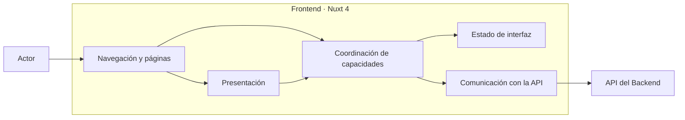

# Arauco Project Hub

## Engineering Playbook

# Arquitectura del Frontend

**Versión:** 1.0

**Estado:** Approved

**Fecha:** 2026-06-28

---

# 1. Objetivo

Este documento define la arquitectura interna inicial del Frontend de Arauco Project Hub.

Su propósito es establecer cómo Nuxt 4, Vue 3 y TypeScript organizan la navegación, la presentación, la comunicación con la API y el estado de interfaz sin duplicar reglas del dominio ni convertir las convenciones del framework en límites del producto.

Esta arquitectura deriva de los SRS, ADR y documentos de arquitectura aprobados. No incorpora conceptos nuevos al dominio.

---

# 2. Alcance

Este documento establece:

* Las responsabilidades internas del Frontend.
* La dirección de sus dependencias.
* La composición general de páginas y capacidades.
* La separación entre presentación, coordinación de interfaz y comunicación con la API.
* El manejo general del estado de interfaz, validaciones, errores y pruebas.
* Los límites para utilizar las capacidades de Nuxt.

Quedan fuera del alcance:

* El diseño visual definitivo.
* La biblioteca de componentes y estilos.
* La estructura física definitiva de carpetas.
* El modo de renderizado.
* La autenticación y autorización.
* El proveedor de identidad.
* El diseño detallado y versionado de la API.
* La estrategia de despliegue.
* Los requerimientos no funcionales todavía no aprobados.

---

# 3. Restricciones Aprobadas

El Frontend debe:

* Utilizar Nuxt 4, Vue 3 y TypeScript.
* Formar parte del monorepo.
* Presentar las capacidades del único módulo de dominio inicial denominado Iniciativas.
* Mantener a la Iniciativa como centro de la navegación y del contexto presentado.
* Utilizar el Lenguaje Ubicuo.
* Comunicarse con el Backend exclusivamente mediante contratos explícitos de la API.
* Mantener las reglas del dominio fuera de páginas, componentes, middleware y estado del cliente.
* No acceder directamente a la persistencia.
* No introducir estados, valores gobernados ni conceptos no aprobados.
* Mantener validaciones propias dentro del monorepo.

---

# 4. Principios

## 4.1 La Iniciativa organiza la experiencia

La navegación y la presentación deben conservar el contexto de la Iniciativa.

Participantes, Componentes, Recursos, Documentos, Conversaciones, Solicitudes, Versiones, Despliegues e Historial se presentan como responsabilidades relacionadas con una Iniciativa y no como productos o módulos independientes.

## 4.2 Las páginas componen

Las páginas representan destinos de navegación y componen las capacidades necesarias para presentar una vista.

No deben concentrar reglas del dominio, acceso directo a la API ni estado compartido sin un límite explícito.

## 4.3 La API es el límite de verdad

El Frontend puede anticipar errores de forma o mejorar la interacción, pero el resultado oficial de una acción proviene del Backend.

El estado de interfaz no reemplaza el estado vigente de la Iniciativa ni de una Solicitud.

## 4.4 Dependencias explícitas

Los componentes visuales dependen de datos y acciones explícitas.

La comunicación con la API y la coordinación de una capacidad no deben quedar ocultas por auto-imports cuando atraviesen límites internos.

## 4.5 Estado mínimo

El estado debe mantenerse lo más cerca posible de la vista que lo utiliza.

Solo se comparte cuando varias partes de la experiencia necesitan la misma información o coordinación. No se duplica información obtenida de la API sin una necesidad concreta.

## 4.6 Simplicidad inicial

La arquitectura incorpora únicamente los límites necesarios para presentar las capacidades aprobadas y proteger los contratos.

No se adoptan abstracciones, bibliotecas de estado ni capas adicionales sin una necesidad validada.

---

# 5. Vista General

Las agrupaciones representan responsabilidades internas del Frontend. No son módulos del dominio ni obligan a una estructura física determinada.

---

# 6. Navegación y Páginas

## 6.1 Responsabilidades

La navegación y las páginas deben:

* Definir destinos comprensibles mediante el Lenguaje Ubicuo.
* Mantener visible el contexto de la Iniciativa.
* Obtener los identificadores necesarios desde la navegación.
* Componer presentación y capacidades.
* Coordinar estados generales de carga, ausencia y error de la vista.
* Evitar que una navegación incompleta muestre información fuera de contexto.

## 6.2 Organización

Las rutas relacionadas con Participantes, Componentes, Recursos, Documentos, Conversaciones, Solicitudes, Versiones, Despliegues e Historial deben conservar la relación con la Iniciativa.

La estructura exacta de rutas permanece Pendiente hasta definir las capacidades iniciales y los contratos de la API.

## 6.3 Límites

Las páginas no deben:

* Aplicar reglas del dominio.
* Acceder directamente a la persistencia.
* Construir contratos de API de manera repetida.
* Mantener copias independientes del mismo estado oficial.
* Convertir cada entidad presentada en un módulo del Frontend.

Los layouts deben resolver composición visual común. No deben introducir reglas de negocio ni asumir permisos todavía no aprobados.

---

# 7. Presentación

## 7.1 Componentes de Presentación

Los componentes de presentación deben:

* Mostrar información y acciones de forma comprensible.
* Recibir datos mediante contratos explícitos.
* Comunicar intenciones mediante eventos o acciones explícitas.
* Representar carga, ausencia, error y resultado cuando corresponda.
* Utilizar el Lenguaje Ubicuo cuando presenten conceptos del dominio.

## 7.2 Componentes Reutilizables

Un componente se comparte cuando existe una necesidad repetida y estable.

La semejanza visual aislada no obliga a crear una abstracción común. Se debe evitar que un componente genérico acumule diferencias de varias capacidades mediante configuración excesiva.

## 7.3 Formularios

Los formularios deben:

* Representar únicamente información respaldada por contratos y conceptos aprobados.
* Distinguir datos obligatorios y opcionales.
* Conservar los valores ingresados ante errores recuperables.
* Mostrar errores cerca del dato o acción correspondiente.
* Impedir envíos repetidos mientras una acción está en curso cuando corresponda.

Un formulario no constituye la fuente oficial de reglas, estados ni valores gobernados.

---

# 8. Coordinación de Capacidades

## 8.1 Propósito

La coordinación de capacidades conecta páginas y componentes con las operaciones expuestas por la API.

## 8.2 Responsabilidades

Debe:

* Representar una intención reconocible del producto.
* Obtener el contexto requerido de la Iniciativa.
* Traducir datos de interfaz hacia un contrato de entrada.
* Invocar la comunicación con la API.
* Traducir el resultado hacia datos presentables.
* Coordinar carga, confirmación y error.
* Actualizar o invalidar la información afectada después de una acción exitosa.

## 8.3 Límites

La coordinación no debe:

* Reimplementar reglas del dominio.
* Determinar transiciones de Estado de Iniciativa o Estado de Solicitud.
* Inventar valores gobernados.
* Depender de detalles de persistencia.
* Ocultar errores del Backend que el actor necesita comprender.

Las capacidades pueden organizarse alrededor de las responsabilidades internas de Iniciativas, pero esas agrupaciones no constituyen nuevos módulos del dominio.

---

# 9. Comunicación con la API

## 9.1 Contratos

Los contratos de entrada y salida deben:

* Representarse explícitamente con TypeScript.
* Utilizar el Lenguaje Ubicuo cuando expresen conceptos del dominio.
* Mantener separados los datos externos de las propiedades internas de componentes.
* Evitar depender de entidades internas del Backend o estructuras del Modelo Relacional.
* Distinguir datos obligatorios, opcionales y ausentes.

Los tipos TypeScript ayudan a verificar el desarrollo, pero no validan por sí solos la información recibida durante la ejecución.

## 9.2 Cliente de API

La comunicación con la API debe:

* Centralizar la configuración técnica común.
* Construir solicitudes conforme a contratos explícitos.
* Interpretar respuestas y errores de forma uniforme.
* Permitir cancelación o reemplazo de consultas cuando una navegación las vuelve innecesarias.
* Evitar que componentes visuales dependan directamente del mecanismo de transporte.

## 9.3 Traducción

Cuando una representación de la API no sea adecuada para la presentación, la traducción debe ocurrir dentro de la capacidad correspondiente.

No se crearán modelos paralelos si el contrato puede utilizarse directamente sin acoplar la presentación a detalles técnicos.

El diseño de endpoints, versionado, formato de errores y generación de contratos permanecen Pendientes.

---

# 10. Estado de Interfaz

## 10.1 Clasificación

El Frontend distingue:

* Estado remoto: información obtenida desde la API.
* Estado de interacción: selección, edición, filtros y controles de una vista.
* Estado de navegación: parámetros y destino actual.

Esta clasificación describe responsabilidades técnicas y no incorpora conceptos al dominio.

## 10.2 Reglas

El estado de interfaz debe:

* Tener una fuente reconocible.
* Mantenerse cerca de quien lo utiliza.
* Evitar copias divergentes de información remota.
* Invalidarse o actualizarse después de acciones exitosas.
* Restablecerse cuando cambia el contexto de la Iniciativa.
* Representar explícitamente carga, éxito, ausencia y error cuando corresponda.

## 10.3 Estado Compartido

El estado compartido se justifica cuando:

* Varias vistas necesitan coordinar la misma interacción.
* Debe sobrevivir a una navegación definida.
* Evita consultas repetidas con un beneficio verificable.

La selección de una biblioteca de estado requiere una necesidad concreta. Nuxt y Vue deben utilizarse inicialmente con sus capacidades propias.

---

# 11. Flujo de una Interacción

## 11.1 Consulta

Una consulta sigue este flujo:

1. El actor navega hacia una vista.
2. La página identifica la Iniciativa y el contexto requerido.
3. La capacidad solicita información mediante el cliente de API.
4. El Frontend representa el estado de carga.
5. La API devuelve un resultado conforme al contrato.
6. La capacidad traduce el resultado cuando es necesario.
7. La presentación muestra la información o un estado comprensible de ausencia o error.

## 11.2 Acción

Una acción sigue este flujo:

1. El actor inicia una acción desde la presentación.
2. El Frontend valida la forma de los datos.
3. La capacidad construye el contrato de entrada.
4. El cliente de API envía la solicitud.
5. El Backend aplica las reglas y devuelve el resultado oficial.
6. La capacidad actualiza o invalida la información afectada.
7. La presentación comunica el resultado.

El Frontend no presenta una acción como confirmada antes de contar con un resultado que lo permita. Las actualizaciones optimistas requerirán una decisión posterior cuando exista una necesidad validada.

---

# 12. Validación

La validación se distribuye por responsabilidad:

## 12.1 Interfaz

Verifica:

* Presencia de datos obligatorios.
* Formatos básicos.
* Coherencia necesaria para construir el contrato.

Su propósito es ofrecer respuesta temprana al actor.

## 12.2 Contrato en Ejecución

Verifica, cuando el riesgo lo requiera:

* Forma de las respuestas externas.
* Presencia de datos requeridos.
* Valores que el Frontend puede representar con seguridad.

## 12.3 Backend y Dominio

El Backend conserva la responsabilidad oficial sobre:

* Reglas e invariantes.
* Estados y valores gobernados.
* Transiciones permitidas.
* Autorización.
* Consistencia y trazabilidad.

Una validación del Frontend nunca sustituye estas responsabilidades.

---

# 13. Manejo de Errores

El Frontend debe distinguir, al menos conceptualmente:

* Error de forma antes del envío.
* Regla del dominio incumplida.
* Información no encontrada.
* Acción no permitida.
* Conflicto con el estado vigente.
* Indisponibilidad o fallo técnico.

Los errores deben:

* Presentarse en el contexto donde pueden resolverse.
* Conservar la información ingresada cuando sea seguro.
* Permitir reintento solo cuando la operación lo admita.
* Evitar exponer trazas, datos sensibles o detalles internos.
* Mantener un tratamiento general para errores que impiden presentar una página.

La correspondencia definitiva depende del formato de errores de la API, que permanece Pendiente.

---

# 14. Navegación, Acceso y Seguridad

Hasta que se apruebe la arquitectura de seguridad, el Frontend debe:

* No asumir que ocultar una acción constituye autorización.
* No confiar en el estado del cliente para proteger información.
* Evitar incluir información sensible en rutas o registros del navegador.
* Tratar todo dato recibido como externo al límite de ejecución.
* Preparar la navegación para comunicar acciones no permitidas sin definir permisos no aprobados.

El middleware de Nuxt puede coordinar navegación técnica, pero no debe convertirse en la fuente de reglas del dominio ni de autorización.

La autenticación, autorización, sesiones y proveedor de identidad permanecen Pendientes.

---

# 15. Capacidades de Nuxt

## 15.1 Enrutamiento y Layouts

Se utilizarán para navegación y composición de vistas conforme a las responsabilidades definidas en este documento.

## 15.2 Obtención de Datos

Las capacidades de obtención de datos de Nuxt podrán utilizarse detrás de límites explícitos de comunicación y coordinación.

Su uso no debe distribuir llamadas a la API sin una responsabilidad reconocible.

## 15.3 Auto-imports

Los auto-imports pueden utilizarse para elementos locales y convencionales.

Las dependencias que atraviesen capacidades o límites internos deben permanecer reconocibles durante la lectura y revisión del código.

## 15.4 Capacidades de Servidor

Este documento no autoriza incorporar reglas del dominio ni capacidades del Backend en el servidor de Nuxt.

El uso de capacidades de servidor y el modo de renderizado requieren requerimientos no funcionales y de despliegue aprobados.

---

# 16. Accesibilidad y Experiencia

La presentación debe:

* Utilizar estructura semántica.
* Permitir interacción mediante teclado.
* Mantener foco y mensajes comprensibles después de acciones y errores.
* Asociar etiquetas, ayudas y errores con sus controles.
* Evitar depender únicamente del color para comunicar estado.
* Mantener visibles el contexto y el resultado de una acción.

Los criterios medibles, navegadores soportados y estándar de accesibilidad permanecen Pendientes de requerimientos no funcionales.

---

# 17. Pruebas

La estrategia del Frontend debe permitir:

## 17.1 Pruebas de Presentación

* Verificar datos, acciones y estados visibles.
* Verificar interacción accesible.
* Verificar carga, ausencia y error.

## 17.2 Pruebas de Capacidades

* Verificar construcción de contratos.
* Verificar traducción de resultados y errores.
* Verificar actualización o invalidación de información.
* Verificar que no se confirme una acción rechazada.

## 17.3 Pruebas de Comunicación

* Verificar contratos y configuración común.
* Verificar respuestas inválidas y fallos técnicos.
* Verificar que los detalles de transporte no alcancen la presentación.

## 17.4 Pruebas de Flujo

* Verificar navegación y capacidades críticas mediante el Frontend y la API.
* Verificar que el contexto de la Iniciativa se conserve.
* Verificar resultados exitosos, rechazos y conflictos relevantes.

La selección de bibliotecas y el alcance cuantitativo de cobertura permanecen Pendientes.

---

# 18. Estructura Física

La estructura física deberá:

* Mantener visibles las capacidades relacionadas con Iniciativas.
* Separar páginas, presentación, coordinación y comunicación con la API.
* Evitar carpetas genéricas que acumulen responsabilidades sin relación.
* Evitar organizar el producto únicamente por tipos técnicos.
* Mantener las dependencias reconocibles.
* Permitir pruebas sin requerir siempre navegación o una API real.

Los nombres de carpetas y las convenciones exactas requieren una decisión posterior. Si esa decisión incorpora una organización arquitectónica significativa o una dependencia nueva, deberá proponerse mediante ADR.

---

# 19. Criterios de Cumplimiento

La implementación cumple este documento cuando:

* Utiliza Nuxt 4, Vue 3 y TypeScript.
* Mantiene a la Iniciativa como centro del contexto presentado.
* Utiliza el Lenguaje Ubicuo.
* Mantiene las páginas como puntos de composición.
* Separa presentación, coordinación y comunicación con la API.
* Utiliza contratos de API explícitos.
* Mantiene un estado de interfaz mínimo y con fuente reconocible.
* No duplica reglas del dominio ni confía en validaciones del Frontend como fuente oficial.
* No accede directamente a la persistencia.
* No convierte entidades o páginas en nuevos módulos.
* Permite probar capacidades sin depender siempre del Backend real.
* No resuelve Pendientes mediante supuestos tecnológicos.

---

# 20. Trade-offs

## 20.1 Ventajas

* Mantiene las responsabilidades del Frontend reconocibles.
* Protege las reglas del dominio frente a detalles de Nuxt.
* Reduce la duplicación de llamadas, validaciones y estado.
* Facilita pruebas de presentación y coordinación.
* Permite evolucionar contratos y componentes con límites explícitos.

## 20.2 Costos

* Requiere traducción cuando el contrato de la API y la presentación tienen necesidades distintas.
* Exige disciplina para mantener páginas y componentes acotados.
* Introduce límites internos que deben justificarse y conservarse.

## 20.3 Aspectos a Revisar

* Diseño de la API.
* Modo de renderizado.
* Autenticación y autorización.
* Manejo de estado compartido.
* Biblioteca de componentes y estilos.
* Requerimientos no funcionales.
* Estructura física del Frontend.

---

# 21. Trazabilidad Documental

Este documento deriva principalmente de:

* PHIL-001.
* SRS-001 - Visión del Producto.
* SRS-002 - Lenguaje Ubicuo.
* SRS-003 - Modelo de Dominio.
* SRS-004 - Modelo Operacional.
* ADR-001 - Arquitectura Basada en el Negocio.
* ADR-002 - Monorepo.
* ADR-003 - Frontend con Nuxt 4.
* Visión de Arquitectura.
* Módulos.
* Modelo de Dominio Arquitectónico.
* Arquitectura del Backend.

---

# 22. Pendientes

* Definir las capacidades iniciales y la estructura de navegación.
* Definir el diseño y versionado de la API.
* Definir el formato de errores.
* Definir el modo de renderizado.
* Definir autenticación y autorización.
* Definir la estrategia de sesiones.
* Definir la biblioteca de componentes y estilos.
* Definir los navegadores soportados y criterios de accesibilidad.
* Definir la estrategia de estado compartido si aparece una necesidad validada.
* Definir la estructura física de carpetas.
* Definir la estrategia detallada de pruebas.
* Aprobar requerimientos no funcionales.

Cada decisión arquitectónica importante deberá documentarse mediante ADR.

---

# 23. Estado del Documento

**Estado actual:** Approved

Este documento constituye la fuente oficial para la arquitectura interna del Frontend de Arauco Project Hub.
