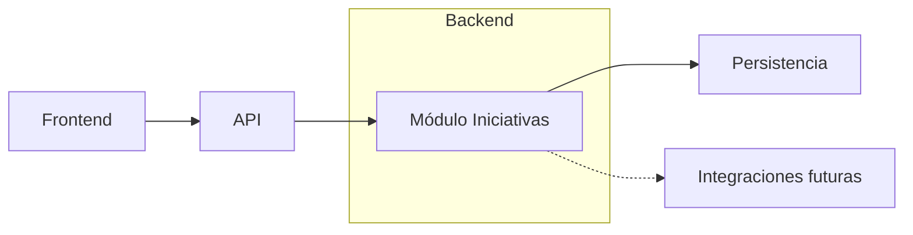
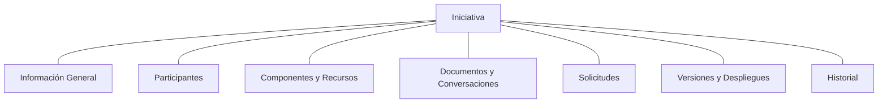

# Arauco Project Hub

## Engineering Playbook

# Módulos

**Versión:** 1.0

**Estado:** Approved

**Fecha:** 2026-06-28

---

# 1. Objetivo

Este documento define la organización modular inicial de Arauco Project Hub.

Su propósito es establecer límites y responsabilidades internas que mantengan a la Iniciativa como Aggregate Root principal, eviten fragmentar el producto según entidades o tecnologías y permitan evolucionar la implementación con trazabilidad.

La organización modular deriva del Modelo de Dominio y de la Visión de Arquitectura aprobados. No crea nuevos conceptos del dominio.

---

# 2. Alcance

Este documento establece:

* El criterio para definir módulos.
* El módulo de dominio inicial.
* Sus responsabilidades internas.
* Las dependencias permitidas.
* La relación con Frontend, API, persistencia e integraciones.
* Los criterios para revisar los límites.

Quedan fuera del alcance:

* La estructura física definitiva de carpetas.
* La arquitectura interna detallada del Backend.
* La arquitectura interna detallada del Frontend.
* El diseño de endpoints.
* La tecnología de persistencia.
* La autenticación y autorización.
* La infraestructura y el despliegue.
* La definición de nuevos Aggregate Roots.

---

# 3. Principios Modulares

## 3.1 El dominio define los límites

Un módulo debe representar una responsabilidad coherente del dominio y no una agrupación determinada únicamente por un framework, una tabla o una pantalla.

## 3.2 La Iniciativa conserva su contexto

Las responsabilidades asociadas a Participantes, Componentes, Recursos, Documentos, Conversaciones, Solicitudes, Versiones, Despliegues e Historial permanecen dentro del contexto de la Iniciativa.

## 3.3 Una entidad no implica un módulo

La existencia de una entidad o estructura relacional no justifica crear un módulo independiente.

Solicitudes, Conversaciones, Versiones e Historial representan responsabilidades del ciclo de vida de una Iniciativa y no módulos autónomos en esta etapa.

## 3.4 Las dependencias son explícitas

Frontend, API, persistencia e integraciones colaboran con el módulo mediante contratos definidos. No acceden libremente a sus estructuras internas.

## 3.5 La simplicidad prevalece

Se mantiene un único módulo de dominio mientras el modelo aprobado no demuestre la necesidad de límites adicionales.

## 3.6 Los límites pueden evolucionar

Un nuevo módulo requiere una responsabilidad estable, reglas propias y una necesidad validada. La conveniencia organizacional o tecnológica no es suficiente.

---

# 4. Organización Modular Inicial

Arauco Project Hub tendrá inicialmente un único módulo de dominio:

* Iniciativas.

El módulo Iniciativas representa el ciclo de vida completo definido en SRS-003 y SRS-004.

La API, la persistencia y las integraciones no son módulos del dominio. Son límites técnicos que adaptan la interacción con el módulo Iniciativas.

---

# 5. Módulo Iniciativas

## 5.1 Propósito

Administrar el contexto y ciclo de vida completo de una Iniciativa, desde la Idea hasta la Operación, incluyendo su evolución mediante Solicitudes.

## 5.2 Responsabilidad Principal

El módulo debe:

* Crear y mantener Iniciativas.
* Proteger las reglas del dominio.
* Mantener un único Estado de Iniciativa vigente.
* Coordinar los cambios de etapa.
* Mantener el contexto completo de la Iniciativa.
* Conservar trazabilidad de acciones y decisiones relevantes.
* Mantener la continuidad entre Producción, Operación y evolución.

## 5.3 Información General

Incluye:

* Negocio.
* Nombre.
* Objetivo.
* Justificación.
* Beneficio esperado.
* Estado de Iniciativa.
* Fecha de creación.

Reglas principales:

* Toda Iniciativa pertenece a un Negocio.
* Toda Iniciativa tiene un único Estado de Iniciativa vigente.
* Los cambios de estado deben conservar trazabilidad.

## 5.4 Participantes

Incluye:

* Participante.
* Rol de Participación.
* Identificación de la persona o equipo.

Reglas principales:

* Todo Participante pertenece al contexto de una Iniciativa.
* Una misma persona o equipo puede participar en distintas Iniciativas con roles diferentes.
* La Iniciativa debe conservar las responsabilidades requeridas por las reglas aprobadas.

La integración con una fuente corporativa de personas permanece Pendiente.

## 5.5 Componentes y Recursos

Incluye:

* Componente.
* Tipo de Componente.
* Recurso.
* Ambientes requeridos.

Reglas principales:

* Todo Componente y Recurso pertenece a una Iniciativa.
* Los valores gobernados no son configuraciones libres.
* Los flujos de Recursos pueden avanzar en paralelo cuando la Iniciativa lo requiera.

Los Estados de Recurso permanecen Pendientes.

## 5.6 Documentos y Conversaciones

Incluye:

* Documento.
* Conversación de Iniciativa.
* Conversación de Solicitud.

Reglas principales:

* Todo Documento y Conversación conserva el contexto de una Iniciativa.
* Una Conversación puede estar asociada además a una Solicitud de la misma Iniciativa.
* Las aprobaciones, rechazos y decisiones relevantes deben conservar su fundamento.
* Los Documentos y Conversaciones no se eliminan al cerrar o cancelar una Iniciativa.

## 5.7 Solicitudes

Incluye:

* Solicitud.
* Tipo de Solicitud.
* Prioridad.
* Estado de Solicitud.

Reglas principales:

* Toda Solicitud pertenece a una Iniciativa.
* Una Solicitud no existe de manera aislada.
* El Estado de Solicitud es independiente del Estado de Iniciativa.
* Las Solicitudes permiten la evolución de una Iniciativa en Operación.

La relación entre Solicitudes y Versiones permanece Pendiente de validación.

## 5.8 Versiones y Despliegues

Incluye:

* Versión.
* Despliegue.
* Ambiente.
* Resultado, observaciones y evidencia.

Reglas principales:

* Toda Versión pertenece a una Iniciativa.
* Todo Despliegue corresponde a una Versión y ocurre en un Ambiente.
* Todo paso a PRD debe registrarse como Despliegue.
* Una Identificación de Versión no se repite dentro de una Iniciativa.

Los valores de Resultado de Despliegue permanecen Pendientes.

## 5.9 Historial

Incluye:

* Evento.
* Fecha.
* Participante responsable cuando corresponda.
* Estado anterior y estado nuevo cuando corresponda.
* Descripción.

Reglas principales:

* Toda acción relevante genera un evento del Historial.
* Todo evento pertenece a una Iniciativa.
* Un evento puede referenciar una Solicitud de la misma Iniciativa.
* El Historial registra lo ocurrido y no reemplaza el estado actual.
* Los eventos no se modifican para sustituir lo ocurrido.

El catálogo de eventos del dominio permanece Pendiente.

---

# 6. Colaboración Interna

Las responsabilidades internas colaboran a través de la Iniciativa.

Las agrupaciones del diagrama representan responsabilidades internas para facilitar comprensión y mantenimiento. No son módulos independientes ni nuevos conceptos del dominio.

---

# 7. Límites Técnicos

## 7.1 Frontend

El Frontend:

* Presenta las capacidades del módulo.
* Utiliza contratos explícitos de la API.
* No aplica como fuente oficial las reglas del dominio.
* No accede directamente a la persistencia.

## 7.2 API

La API:

* Expone capacidades del módulo.
* Traduce contratos externos hacia solicitudes del Backend.
* No expone directamente entidades del dominio ni estructuras de persistencia.
* No se convierte en un módulo del dominio.

## 7.3 Persistencia

La persistencia:

* Implementa el Modelo Relacional aprobado.
* Recupera y conserva el estado requerido por el módulo.
* Mantiene integridad referencial.
* No define límites modulares.

## 7.4 Integraciones

Las integraciones:

* Se adaptan al módulo mediante contratos explícitos.
* No reemplazan el Lenguaje Ubicuo.
* No acceden directamente a las estructuras internas.
* Se incorporan únicamente cuando exista una necesidad aprobada.

---

# 8. Dependencias Permitidas

| Origen | Puede depender de | Restricción |
| --- | --- | --- |
| Frontend | Contratos públicos de la API. | No depende de estructuras internas del módulo. |
| API | Capacidades expuestas por el Backend. | No contiene las reglas principales del dominio. |
| Backend | Módulo Iniciativas y contratos técnicos. | Coordina sin redefinir el dominio. |
| Módulo Iniciativas | Conceptos y reglas aprobadas. | No depende de Nuxt, ASP.NET Core ni persistencia. |
| Persistencia | Contratos requeridos por el Backend y Modelo Relacional. | No define el módulo ni sus reglas. |
| Integraciones | Contratos de adaptación. | No sustituyen conceptos internos. |

---

# 9. Criterios para Crear un Nuevo Módulo

Un nuevo módulo podrá proponerse cuando concurran varias de las siguientes condiciones:

* Existe una responsabilidad del Negocio claramente diferenciada.
* Existen reglas y ciclo de vida propios.
* El concepto está aprobado en el Lenguaje Ubicuo y el Modelo de Dominio.
* El límite reduce acoplamiento real y no solo organiza archivos.
* La interacción con Iniciativas puede expresarse mediante contratos explícitos.
* El cambio no fragmenta el contexto que debe conservar la Iniciativa.
* La complejidad agregada está justificada por una necesidad validada.

La creación de un nuevo módulo importante deberá proponerse mediante ADR y, si incorpora conceptos del dominio, requerirá primero la revisión del SRS correspondiente.

---

# 10. Criterios de Cumplimiento

La implementación cumple esta organización cuando:

* Existe un único módulo de dominio inicial denominado Iniciativas.
* La Iniciativa conserva la responsabilidad sobre su contexto.
* Las entidades relacionadas no se convierten automáticamente en módulos.
* Las reglas del dominio permanecen dentro del módulo.
* Los límites técnicos utilizan contratos explícitos.
* La persistencia no define la organización modular.
* Las dependencias del dominio no apuntan hacia frameworks o integraciones.
* Toda complejidad modular adicional se documenta y justifica.

---

# 11. Trade-offs

## 11.1 Ventajas

* Mantiene una correspondencia directa con el dominio aprobado.
* Reduce coordinación y dependencias internas.
* Evita fragmentar prematuramente la Iniciativa.
* Facilita cambios que afectan varias responsabilidades del ciclo de vida.
* Mantiene la arquitectura inicial simple.

## 11.2 Costos

* El módulo puede crecer a medida que aumenten las capacidades.
* Requiere disciplina para mantener responsabilidades internas claras.
* Las fronteras futuras deberán extraerse de manera intencional.

## 11.3 Aspectos a Revisar

* Crecimiento y cohesión del módulo.
* Frecuencia de cambios conjuntos entre responsabilidades.
* Aparición de nuevos Aggregate Roots aprobados.
* Necesidad de límites operacionales o de seguridad diferentes.

---

# 12. Trazabilidad

Este documento deriva principalmente de:

* PHIL-001: simplicidad, Iniciativa como centro y evolución intencional.
* SRS-002: Lenguaje Ubicuo y relaciones fundamentales.
* SRS-003: Modelo de Dominio, Aggregate Root y reglas del dominio.
* SRS-004: Modelo Operacional y continuidad del ciclo de vida.
* ADR-001: arquitectura derivada del dominio.
* ADR-002: monorepo con límites explícitos.
* ADR-003: Frontend separado de las reglas del dominio.
* ADR-004: Backend con dominio separado del framework y la persistencia.
* Visión de Arquitectura: componentes y dependencias permitidas.

---

# 13. Pendientes

* Validar que un único módulo de dominio representa adecuadamente el alcance inicial.
* Definir la arquitectura interna del Backend sin fragmentar el módulo.
* Definir la arquitectura interna del Frontend alrededor de capacidades del producto.
* Definir los contratos de la API.
* Resolver los Pendientes de dominio identificados en SRS-003, SRS-004 y SRS-010.
* Definir criterios medibles para revisar el crecimiento del módulo.
* Formalizar mediante ADR cualquier cambio futuro que agregue o divida módulos.

---

# 14. Estado del Documento

**Estado actual:** Approved

Este documento constituye la fuente oficial para la organización modular de Arauco Project Hub.
