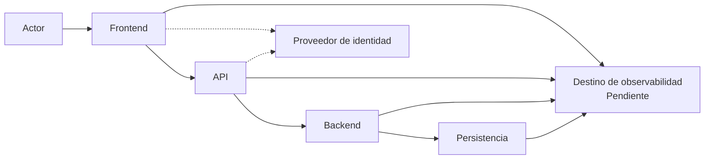

# Arauco Project Hub

## Engineering Playbook

# Arquitectura de Observabilidad

**Versión:** 1.0

**Estado:** Approved

**Fecha:** 2026-06-28

---

# 1. Objetivo

Este documento define la arquitectura inicial de observabilidad de Arauco Project Hub.

Su propósito es establecer cómo se correlacionan y observan las interacciones técnicas del Frontend, la API, el Backend y sus adaptaciones para diagnosticar fallos, conocer el estado operacional y verificar requerimientos no funcionales sin exponer información sensible ni sustituir el Historial.

Esta arquitectura deriva de los SRS y documentos de arquitectura aprobados. No incorpora conceptos nuevos al dominio.

---

# 2. Alcance

Este documento establece:

* Los principios de observabilidad.
* Las responsabilidades por componente.
* La correlación de una interacción técnica.
* El propósito de registros, métricas y trazas.
* Las señales mínimas de disponibilidad, errores, rendimiento, recursos y dependencias.
* La protección de información.
* Los criterios de fallos, pruebas y operación.
* La separación entre observabilidad e Historial.

Quedan fuera del alcance:

* La selección de una plataforma de observabilidad.
* La selección de bibliotecas o servicios concretos.
* Los formatos físicos definitivos.
* Las métricas, umbrales y alertas específicos.
* La retención de señales.
* Los tableros operacionales.
* Los procedimientos de respuesta a incidentes.
* La infraestructura y el despliegue.
* El análisis funcional o de uso de actores.

Las decisiones tecnológicas transversales deberán formalizarse mediante ADR.

---

# 3. Restricciones Aprobadas

La observabilidad debe:

* Correlacionar interacciones a través del Frontend, la API, el Backend y sus adaptaciones.
* Registrar información suficiente para diagnosticar fallos.
* Permitir conocer disponibilidad, errores, rendimiento, uso de recursos técnicos y estado de dependencias.
* Mantener registros, métricas y trazas separados del Historial.
* Evitar credenciales, secretos y datos sensibles completos.
* Evitar exponer trazas y detalles internos en contratos de API.
* Mantener configuración e información operacional separadas por Ambiente.
* Permitir relacionar errores públicos con información diagnóstica mediante un identificador de correlación.

---

# 4. Principios

## 4.1 La observabilidad explica el comportamiento técnico

Las señales técnicas permiten conocer qué componente intervino, cuánto tardó, qué resultado obtuvo y dónde ocurrió un fallo.

No determinan reglas del dominio ni prueban por sí solas que una acción funcional ocurrió.

## 4.2 El Historial explica lo ocurrido en el producto

El Historial conserva eventos relevantes de la Iniciativa y sus responsabilidades.

Los registros, métricas y trazas pueden perderse o expirar conforme a una política operacional. Por esta razón, nunca reemplazan al Historial.

## 4.3 La correlación atraviesa componentes

Una interacción técnica conserva un identificador de correlación desde su entrada hasta las adaptaciones involucradas.

## 4.4 La información se minimiza

Cada señal contiene únicamente la información necesaria para operación y diagnóstico.

No se registran cuerpos completos, credenciales, secretos ni información sensible por comodidad técnica.

## 4.5 Las señales deben permitir actuar

Una señal operacional debe contribuir a detectar, comprender o verificar una condición. No se incorporan señales sin un propósito reconocible.

---

# 5. Señales

## 5.1 Registros

Los registros describen eventos técnicos discretos.

Deben permitir conocer:

* Momento del evento.
* Ambiente y componente.
* Identificador de correlación.
* Tipo de operación técnica.
* Resultado.
* Duración cuando corresponda.
* Tipo de error controlado.
* Dependencia involucrada cuando corresponda.

No deben contener:

* Credenciales o referencias de sesión completas.
* Secretos o cadenas de conexión.
* Cuerpos completos de solicitudes o respuestas.
* Contenido completo de Documentos o Conversaciones.
* Datos internos de credenciales.
* Trazas expuestas al actor.

## 5.2 Métricas

Las métricas representan medidas agregables del comportamiento técnico.

Deben permitir evaluar:

* Disponibilidad.
* Cantidad y proporción de errores.
* Duración de operaciones.
* Uso de recursos técnicos.
* Estado y duración de dependencias.
* Conflictos de concurrencia.
* Confirmaciones y reversiones de persistencia.
* Intentos y rechazos de autenticación en la medida permitida.

Las dimensiones deben ser acotadas. No se utilizarán identificadores de Iniciativa, Participante, Solicitud o correlación como dimensiones de alta variabilidad.

## 5.3 Trazas

Las trazas representan el recorrido técnico de una interacción entre componentes.

Deben permitir:

* Reconstruir la secuencia Frontend, API, Backend y adaptaciones.
* Identificar operaciones internas y dependencias.
* Medir duración total y por tramo.
* Ubicar errores y esperas.
* Relacionarse mediante el identificador de correlación.

Una traza no representa el Historial de una Iniciativa.

---

# 6. Vista General

El diagrama expresa producción y envío de señales. No selecciona una plataforma ni exige que todos los componentes se comuniquen directamente con un único servicio.

---

# 7. Correlación

## 7.1 Inicio

La primera entrada controlada de una interacción debe:

* Aceptar un identificador de correlación válido cuando proviene de un componente confiable.
* Generar uno cuando no existe o no es aceptable.
* Mantenerlo durante la interacción.

Un valor recibido desde un origen no confiable se valida y limita antes de incorporarlo a registros.

## 7.2 Propagación

Frontend, API, Backend y adaptaciones deben propagar el contexto de correlación mediante mecanismos técnicos explícitos.

Las operaciones internas derivadas de una misma interacción deben poder relacionarse sin utilizar identificadores del dominio como sustituto.

## 7.3 Respuestas y errores

La API puede devolver el identificador de correlación para facilitar soporte.

El identificador:

* No revela detalles internos.
* No autoriza acceso a información diagnóstica.
* No reemplaza un identificador de error estable.
* No constituye un identificador del dominio.

---

# 8. Responsabilidades

## 8.1 Frontend

El Frontend debe:

* Conservar o iniciar la correlación de la interacción.
* Propagarla hacia la API y hacia su componente de servidor.
* Registrar fallos técnicos necesarios para diagnóstico.
* Observar navegación y llamadas técnicas sin registrar contenido sensible.
* Evitar duplicar la misma señal en cliente y servidor sin propósito.

Los errores visibles para el actor deben ser comprensibles y no exponer trazas.

## 8.2 API

La API debe:

* Validar o generar el identificador de correlación.
* Propagarlo al Backend.
* Registrar resultado, duración y tipo de error.
* Evitar registrar contratos completos.
* Incluir correlación en errores públicos cuando se apruebe su formato.

## 8.3 Backend

El Backend debe:

* Mantener la correlación durante coordinación, dominio y adaptaciones.
* Registrar el resultado técnico de cada capacidad.
* Observar duración y fallos de dependencias.
* Distinguir rechazo esperado, conflicto y fallo técnico.
* Evitar introducir dependencias de observabilidad en el Modelo de Dominio.

Las reglas del dominio no registran directamente en una plataforma técnica. La coordinación o los límites técnicos observan sus resultados.

## 8.4 Persistencia

La adaptación de persistencia debe observar:

* Duración de operaciones.
* Confirmaciones y reversiones.
* Conflictos de concurrencia.
* Errores de integridad.
* Fallos transitorios y reintentos.
* Aplicación de migraciones.

No debe registrar consultas con valores sensibles ni cadenas de conexión.

## 8.5 Identidad y sesión

Los componentes responsables deben observar:

* Intentos exitosos y fallidos en la medida permitida.
* Rechazos por credencial ausente o inválida.
* Expiración y cierre.
* Fallos y latencia del proveedor.

Nunca deben registrar credenciales, referencias de sesión completas ni atributos sensibles innecesarios.

---

# 9. Separación del Historial

| Historial | Observabilidad |
| --- | --- |
| Registra eventos relevantes del producto. | Registra comportamiento técnico. |
| Utiliza el Lenguaje Ubicuo. | Utiliza términos técnicos cuando corresponde. |
| Identifica responsabilidad funcional cuando está aprobada. | Identifica componentes y operaciones técnicas. |
| Forma parte de la memoria de la Iniciativa. | Facilita operación y diagnóstico. |
| Se conserva conforme a las reglas del producto. | Su retención depende de una política operacional. |
| No se sustituye con registros técnicos. | No se utiliza como fuente del estado del dominio. |

Una modificación relevante debe conservar su evento de Historial aunque sus señales técnicas se procesen por separado.

La indisponibilidad del destino de observabilidad no debe corromper el dominio ni convertir una operación válida en un estado parcial. El tratamiento exacto de pérdida y envío de señales dependerá de la tecnología seleccionada.

---

# 10. Errores

Los resultados deben distinguir:

* Resultado exitoso.
* Rechazo esperado por validación o autorización.
* Información no encontrada.
* Conflicto de concurrencia.
* Dependencia no disponible.
* Tiempo de espera agotado.
* Fallo técnico inesperado.

Los errores inesperados deben:

* Generar información diagnóstica correlacionada.
* Evitar exponer excepciones, trazas y configuración.
* Evitar registrar repetidamente el mismo fallo en cada límite.
* Conservar la causa técnica cuando la plataforma y política lo permitan.

---

# 11. Disponibilidad y Dependencias

La arquitectura debe permitir conocer el estado técnico de:

* Frontend.
* API y Backend.
* Azure SQL Database.
* Proveedor de identidad.
* Destino de observabilidad.
* Integraciones futuras aprobadas.

Las verificaciones de estado deben:

* Distinguir funcionamiento del componente y disponibilidad de dependencias críticas.
* Ser acotadas y no ejecutar capacidades del dominio.
* No modificar información.
* No exponer configuración ni detalles sensibles.

La definición de qué dependencias bloquean disponibilidad requiere objetivos operacionales validados.

---

# 12. Rendimiento

Se debe poder medir:

* Duración total de interacciones.
* Duración en Frontend, API, Backend y adaptaciones.
* Duración de consultas y confirmaciones de persistencia.
* Duración de llamadas al proveedor de identidad.
* Operaciones prolongadas.
* Uso de recursos técnicos.

Los percentiles, ventanas, objetivos y volúmenes permanecen Pendientes conforme a SRS-006.

La instrumentación deberá evitar una carga desproporcionada. Su costo se evaluará con mediciones representativas.

---

# 13. Protección de Información

Antes de emitir una señal se debe considerar:

* Si el dato es necesario para diagnóstico.
* Si puede reemplazarse por una categoría o identificador técnico.
* Si contiene información sensible, credenciales o secretos.
* Si su variabilidad afecta costo y utilidad.
* Si su conservación requiere una política específica.

La protección debe aplicarse antes de enviar la señal. No se debe depender únicamente de limpieza posterior en la plataforma.

Enmascaramiento, clasificación y retención permanecen Pendientes y deberán validarse con Seguridad y Operación.

---

# 14. Ambientes

Cada Ambiente debe:

* Mantener configuración y credenciales separadas.
* Identificar sus señales de forma inequívoca.
* Evitar mezclar información operacional con otro Ambiente.
* Permitir validar instrumentación antes de Producción.

Los datos de prueba no deben confundirse con señales de Producción.

---

# 15. Alertas y Tableros

Las alertas deben derivar de condiciones que requieran evaluación o acción.

Antes de definir una alerta se debe acordar:

* Condición observada.
* Umbral y ventana.
* Severidad.
* Responsable de atención.
* Canal de notificación.
* Acción inicial.
* Criterio de cierre.

Los tableros deben responder preguntas operacionales concretas, como disponibilidad, errores, rendimiento y dependencias.

Umbrales, alertas, responsables y tableros permanecen Pendientes. No se crearán valores arbitrarios para completar el documento.

---

# 16. Fallo de Observabilidad

La emisión de señales no debe:

* Modificar el resultado del dominio.
* Mantener abierta una transacción de persistencia.
* Exponer información sensible al fallar.
* Producir reintentos ilimitados.
* Bloquear indefinidamente una interacción.

Se debe poder conocer, en la medida técnicamente posible, si la instrumentación o el destino de observabilidad están degradados.

La estrategia de almacenamiento temporal, descarte y reintento deberá definirse con la tecnología seleccionada.

---

# 17. Pruebas

La estrategia debe verificar:

* Generación y propagación de correlación.
* Correlación de una interacción entre componentes.
* Presencia de señales para resultados y fallos representativos.
* Ausencia de credenciales, secretos y datos sensibles completos.
* Ausencia de trazas internas en errores públicos.
* Separación entre señales técnicas e Historial.
* Comportamiento ante indisponibilidad del destino de observabilidad.
* Separación de Ambientes.
* Instrumentación de persistencia e identidad.
* Costo de instrumentación en operaciones representativas.

Las pruebas deben inspeccionar contenido producido, no solo comprobar que una llamada de registro ocurrió.

---

# 18. Criterios de Cumplimiento

La implementación cumple cuando:

* Correlaciona Frontend, API, Backend y adaptaciones.
* Produce registros, métricas y trazas con propósitos diferenciados.
* Permite conocer disponibilidad, errores, rendimiento, recursos y dependencias.
* Mantiene observabilidad e Historial separados.
* No expone credenciales, secretos ni datos sensibles completos.
* No expone excepciones o trazas en contratos públicos.
* Mantiene el Modelo de Dominio independiente de la plataforma.
* Separa señales por Ambiente.
* La indisponibilidad de observabilidad no corrompe el dominio.
* Existen pruebas de correlación, protección y fallos.
* Métricas, umbrales, alertas y retención derivan de objetivos validados.

---

# 19. Riesgos

## 19.1 Exceso de información

Registrar contratos y contenido completo puede exponer información y aumentar costos.

Mitigación:

* Minimizar datos desde el origen.
* Utilizar categorías técnicas y campos explícitos.

## 19.2 Señales sin propósito

Una gran cantidad de señales puede dificultar el diagnóstico.

Mitigación:

* Exigir una pregunta operacional o condición verificable para cada señal.

## 19.3 Alta variabilidad

Dimensiones sin límites pueden degradar métricas y elevar costos.

Mitigación:

* Mantener dimensiones acotadas.
* Conservar identificadores variables en registros o trazas cuando sea necesario.

## 19.4 Confusión con Historial

Los registros técnicos podrían utilizarse como evidencia funcional.

Mitigación:

* Mantener responsabilidades, almacenamiento y retención separados.
* Verificar que las capacidades produzcan Historial conforme a las reglas aprobadas.

## 19.5 Dependencia de plataforma

La instrumentación podría acoplar el Backend o Frontend a un proveedor.

Mitigación:

* Mantener la instrumentación fuera del dominio.
* Formalizar la selección y sus límites mediante ADR.

---

# 20. Trazabilidad

Esta arquitectura deriva principalmente de:

* PHIL-001: FP-004, FP-005, FP-006, FP-009 y FP-011.
* SRS-006: RNF-013, RNF-016 a RNF-019 y RNF-034 a RNF-037.
* ADR-003 - Frontend con Nuxt 4.
* ADR-004 - Backend con .NET 10.
* ADR-005 - Proveedor de Identidad y Estrategia de Sesión.
* ADR-006 - Tecnología y Estrategia de Persistencia.
* Arquitectura del Frontend.
* Arquitectura del Backend.
* Diseño de la API.
* Arquitectura de Seguridad.
* Autenticación.
* Arquitectura de Persistencia.

---

# 21. Pendientes

* Validar métricas y objetivos operacionales.
* Definir umbrales, ventanas y alertas.
* Definir responsables y canales de atención.
* Definir clasificación, enmascaramiento y retención.
* Seleccionar plataforma y tecnología de instrumentación.
* Definir muestreo de trazas.
* Definir tableros operacionales.
* Definir verificaciones de estado por componente.
* Validar costo y carga de instrumentación.
* Definir el formato público de errores y correlación.
* Definir procedimientos de diagnóstico y respuesta.

---

# 22. Siguiente Paso

Después de aprobar esta arquitectura, el siguiente documento propuesto es:

ADR-007 - Plataforma y Estándar de Observabilidad.

Objetivo:

Seleccionar la plataforma, el estándar de instrumentación, el transporte y la estrategia de almacenamiento de señales que implementarán esta arquitectura.

---

# 23. Estado del Documento

**Estado actual:** Approved

Este documento constituye la fuente oficial para la arquitectura de observabilidad de Arauco Project Hub.
