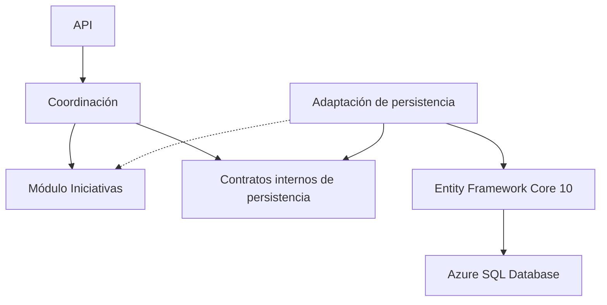
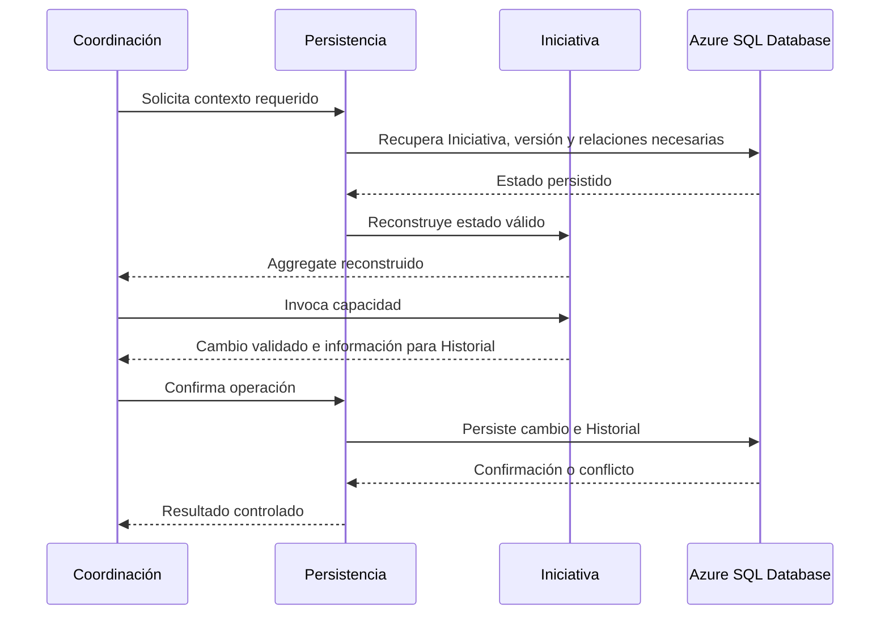

# Arauco Project Hub

## Engineering Playbook

# Arquitectura de Persistencia

**Versión:** 1.0

**Estado:** Approved

**Fecha:** 2026-06-28

---

# 1. Objetivo

Este documento define la arquitectura inicial de persistencia de Arauco Project Hub.

Su propósito es establecer cómo el Backend utiliza Azure SQL Database y Entity Framework Core 10 para reconstruir y persistir el contexto requerido de una Iniciativa, ejecutar consultas, controlar concurrencia y evolucionar el esquema sin trasladar reglas del dominio a la persistencia.

Esta arquitectura deriva de ADR-006, del Modelo Relacional, del DER, del Diccionario de Datos y de las arquitecturas aprobadas. No incorpora conceptos nuevos al dominio.

---

# 2. Alcance

Este documento establece:

* Las responsabilidades de la adaptación de persistencia.
* La dirección de sus dependencias.
* La separación entre modificación y consulta.
* La reconstrucción del contexto requerido del Aggregate.
* El mapeo entre dominio y Modelo Relacional.
* La unidad transaccional.
* El control de concurrencia.
* La evolución controlada del esquema.
* Los criterios de errores, observabilidad y pruebas.

Quedan fuera del alcance:

* La estructura física de proyectos y carpetas.
* El diseño detallado de clases.
* Los tipos físicos, longitudes e índices todavía Pendientes.
* La capacidad y nivel de servicio de Azure SQL Database.
* La estrategia de respaldo y recuperación.
* La administración de secretos y claves.
* El almacenamiento físico del contenido de Documentos.
* Los catálogos que permanecen Pendientes.
* La observabilidad detallada.
* La infraestructura y el despliegue.

---

# 3. Restricciones Aprobadas

La persistencia debe:

* Utilizar Azure SQL Database.
* Utilizar Entity Framework Core 10 y su proveedor oficial para Azure SQL.
* Implementar el Modelo Relacional, el DER y el Diccionario de Datos aprobados.
* Mantener a la Iniciativa como Aggregate Root principal.
* Mantener el dominio libre de dependencias de Entity Framework Core.
* Utilizar configuración explícita para el mapeo.
* Evitar la carga automática implícita de relaciones.
* Reconstruir el contexto requerido por cada capacidad.
* Utilizar proyecciones sin seguimiento para consultas.
* Detectar conflictos mediante concurrencia optimista.
* Conservar cambio e Historial dentro de una misma transacción cuando pertenecen a la misma operación.
* Mantener migraciones versionadas y trazables.
* Evitar migraciones automáticas al iniciar en Producción.

---

# 4. Principios

## 4.1 La persistencia se adapta al dominio

La persistencia conserva y reconstruye estado. No define conceptos, reglas, transiciones ni capacidades.

## 4.2 El contexto requerido se carga explícitamente

Una capacidad recupera solamente las entidades y Objetos de Valor necesarios para aplicar sus reglas. El límite del Aggregate no obliga a cargar todas las relaciones de una Iniciativa.

## 4.3 Modificación y consulta tienen necesidades distintas

Una modificación reconstruye el contexto requerido del Aggregate y utiliza seguimiento de cambios.

Una consulta proyecta directamente la información autorizada hacia una representación de salida y no reconstruye el Aggregate cuando no aplicará comportamiento.

## 4.4 La consistencia inmediata permanece local

El cambio del Aggregate, sus relaciones modificadas y el evento de Historial correspondiente se confirman o revierten conjuntamente en Azure SQL Database.

## 4.5 La evolución del esquema es explícita

El esquema cambia mediante migraciones versionadas, revisadas y trazables hacia documentación aprobada.

---

# 5. Vista General

Reglas:

* La coordinación depende de contratos internos, no de Entity Framework Core.
* La adaptación implementa los contratos internos.
* El dominio no depende de contratos de persistencia, Entity Framework Core ni Azure SQL Database.
* La adaptación puede conocer tipos del dominio únicamente para reconstruirlos y persistirlos.
* La API no accede directamente a la adaptación ni al contexto de Entity Framework Core.
* Ninguna entidad de persistencia se expone mediante la API.

---

# 6. Responsabilidades

## 6.1 Coordinación

La coordinación debe:

* Determinar la capacidad solicitada.
* Identificar la Iniciativa y al Participante responsable.
* Solicitar el contexto requerido mediante un contrato interno.
* Invocar comportamiento del dominio.
* Solicitar una única confirmación de cambios.
* Traducir conflictos y fallos técnicos hacia errores controlados.

La coordinación no debe:

* Construir consultas de Entity Framework Core.
* Conocer tablas, claves foráneas o migraciones.
* Modificar directamente el estado persistido.
* Abrir transacciones durante interacción con el actor o integraciones externas.

## 6.2 Contratos internos de persistencia

Los contratos internos expresan las necesidades de las capacidades del Backend.

Deben:

* Utilizar el Lenguaje Ubicuo cuando representan conceptos del producto.
* Hacer explícito el contexto requerido por una modificación.
* Separar recuperación para modificación de proyecciones para consulta.
* Permitir confirmar los cambios de una operación.
* Evitar exponer consultas componibles, el contexto de Entity Framework Core o entidades de persistencia.

No se define un contrato genérico por entidad. La Iniciativa mantiene el límite de modificación y las consultas se diseñan desde las necesidades aprobadas.

## 6.3 Adaptación de persistencia

La adaptación debe:

* Implementar los contratos internos.
* Configurar el Modelo Relacional.
* Ejecutar consultas y proyecciones.
* Reconstruir estados válidos.
* Mantener el seguimiento técnico de cambios.
* Aplicar el valor técnico de versión.
* Confirmar cambios y transacciones.
* Traducir conflictos y errores del motor.
* Proporcionar migraciones versionadas.

## 6.4 Azure SQL Database

Azure SQL Database debe:

* Conservar los datos relacionales.
* Aplicar claves primarias, foráneas y únicas.
* Proporcionar la transacción local.
* Administrar el valor técnico utilizado para concurrencia.
* Rechazar relaciones que contradigan las restricciones físicas aprobadas.

Las restricciones del motor complementan al dominio y no sustituyen sus reglas.

---

# 7. Contexto de Entity Framework Core

Existirá un contexto de Entity Framework Core alineado con el módulo Iniciativas.

El contexto:

* Pertenece a la adaptación de persistencia.
* Representa las estructuras aprobadas del Modelo Relacional.
* Mantiene una vida acotada a una operación del Backend.
* Realiza como máximo una confirmación ordinaria por modificación.
* No se inyecta en el dominio ni se expone a la API.
* No constituye una abstracción del dominio.

No se crearán múltiples contextos para separar entidades del mismo módulo sin una necesidad validada. Si una capacidad futura exige otro límite transaccional o motor, deberá revisarse esta arquitectura y proponerse un ADR.

---

# 8. Mapeo

El mapeo se define mediante configuración explícita dentro de la adaptación.

Debe establecer:

* Estructuras y nombres físicos aprobados.
* Claves primarias.
* Claves foráneas.
* Claves únicas.
* Obligatoriedad aprobada.
* Conversión de valores gobernados.
* Relaciones y comportamiento de eliminación.
* Valor técnico de versión de la Iniciativa.

El mapeo no debe:

* Utilizar atributos de Entity Framework Core en el dominio.
* Exigir setters públicos para reconstruir entidades.
* Persistir tipos o estados no aprobados.
* Inferir eliminación en cascada cuando pueda destruir trazabilidad.
* Resolver mediante valores predeterminados una obligatoriedad Pendiente.

Los tipos físicos, longitudes, índices y valores predeterminados se definirán después de resolver los Pendientes correspondientes y deberán conservar trazabilidad.

---

# 9. Reconstrucción para Modificación

Cada capacidad que modifica una Iniciativa define el contexto que necesita.

La adaptación debe recuperar:

* La Iniciativa identificada.
* Su valor técnico de versión.
* Las entidades y Objetos de Valor requeridos por la capacidad.
* El contexto necesario para validar pertenencia y reglas.

La reconstrucción debe utilizar mecanismos controlados por el dominio. Un dato persistido incompatible con las reglas aprobadas debe producir un fallo controlado y no una entidad parcialmente válida.

---

# 10. Consultas

Una consulta:

1. Recibe criterios y alcance autorizado desde la coordinación.
2. Construye una proyección explícita.
3. Recupera únicamente los datos requeridos.
4. No habilita seguimiento de cambios.
5. Devuelve una representación interna de salida.
6. Permite que la coordinación construya el contrato de API.

Las consultas deben:

* Aplicar autorización dentro del alcance indicado.
* Limitar resultados cuyo tamaño pueda crecer.
* Utilizar orden determinista cuando exista paginación.
* Evitar cargar colecciones completas sin necesidad.
* Evitar reconstruir el Aggregate para lecturas sin comportamiento.

No se introduce un modelo de lectura persistido separado. Si una necesidad medida exige duplicar información o utilizar otro mecanismo de consulta, deberá proponerse un ADR.

---

# 11. Concurrencia

La Iniciativa tendrá un valor técnico de versión administrado por Azure SQL Database y configurado como control de concurrencia.

En una modificación:

1. La adaptación recupera el valor vigente.
2. Entity Framework Core lo conserva como valor original.
3. La confirmación exige que el valor almacenado no haya cambiado.
4. Azure SQL Database actualiza el valor al persistir.
5. La ausencia de una fila modificada se interpreta como conflicto de concurrencia.

Ante un conflicto:

* Se revierte la operación.
* No se conserva el evento de Historial intentado.
* No se reintenta automáticamente la acción de dominio.
* Se comunica que existe un estado más reciente.
* El actor debe recuperar el estado vigente antes de actuar nuevamente.

El valor técnico de versión no forma parte del dominio ni del Historial.

---

# 12. Transacciones

La unidad transaccional es una capacidad que modifica una Iniciativa.

Una única confirmación de Entity Framework Core debe incluir, cuando corresponda:

* El cambio de la Iniciativa.
* Los cambios de entidades relacionadas.
* Las relaciones modificadas.
* El evento de Historial.

La transacción se confirma solo después de validar las reglas del dominio.

Una transacción explícita se utilizará únicamente si una capacidad aprobada necesita más de una operación de confirmación. En ese caso:

* Permanecerá dentro de la adaptación.
* Tendrá la menor duración posible.
* No incluirá llamadas de red ni integraciones.
* Confirmará o revertirá la capacidad completa.

No se habilita una transacción distribuida.

---

# 13. Integridad y Conservación

La persistencia aplicará las restricciones aprobadas en SRS-010, el DER y el Diccionario de Datos.

En particular:

* Una Iniciativa referencia un Negocio existente.
* Las estructuras dependientes permanecen dentro de su Iniciativa.
* Los Participantes referenciados pertenecen a la Iniciativa correspondiente.
* Una Solicitud referenciada pertenece a la misma Iniciativa.
* La Identificación de Versión es única dentro de una Iniciativa.
* Una combinación de Iniciativa y Ambiente no se repite.
* Estado de Iniciativa y Estado de Solicitud permanecen independientes.
* Cerrar o Cancelar no elimina Documentos, Conversaciones ni Historial.
* El Historial no se actualiza para sustituir lo ocurrido.

No se utilizará eliminación física de una Iniciativa ni de información cuya conservación está exigida por documentos aprobados.

---

# 14. Evolución del Esquema

Las migraciones de Entity Framework Core:

* Se generan durante el desarrollo.
* Se mantienen versionadas junto al Backend.
* Se revisan como código.
* Derivan de una fuente aprobada.
* Se validan en un Ambiente previo a Producción.
* Se aplican mediante el proceso de despliegue aprobado.
* No se aplican automáticamente al iniciar el Backend en Producción.

Cada cambio debe evaluar:

* Compatibilidad con la versión del Backend desplegada.
* Transformación y conservación de datos existentes.
* Duración y bloqueo esperado.
* Mecanismo de recuperación.
* Trazabilidad hacia la decisión o requerimiento correspondiente.

La estrategia operacional detallada de despliegue de migraciones permanece Pendiente.

---

# 15. Errores

La adaptación debe distinguir al menos:

* Información no encontrada.
* Conflicto de concurrencia.
* Violación de integridad.
* Indisponibilidad o error transitorio.
* Error de configuración o mapeo.
* Fallo inesperado de persistencia.

Los errores técnicos:

* No exponen consultas, credenciales, cadenas de conexión ni detalles internos.
* Se traducen a resultados controlados para la coordinación.
* Conservan información diagnóstica segura.
* No convierten automáticamente una violación de persistencia en una regla del dominio.

Los reintentos ante fallos transitorios solo podrán envolver una operación que sea segura de repetir. No deben reutilizar una transacción fallida ni reintentar automáticamente conflictos de concurrencia.

---

# 16. Seguridad

La persistencia debe:

* Utilizar cifrado en tránsito.
* Obtener credenciales y configuración fuera del repositorio.
* Mantener configuración separada por Ambiente.
* Utilizar una identidad con los permisos mínimos necesarios.
* Evitar registrar datos sensibles, credenciales y parámetros completos.
* Aplicar el alcance de autorización recibido para las consultas.

La selección del mecanismo de identidad, secretos, cifrado y clasificación permanece sujeta a las decisiones de seguridad correspondientes.

---

# 17. Observabilidad

La adaptación deberá permitir observar:

* Duración de operaciones de persistencia.
* Cantidad y duración de consultas.
* Confirmaciones y reversiones.
* Conflictos de concurrencia.
* Fallos transitorios y reintentos.
* Errores de integridad.
* Aplicación de migraciones.

Los registros deben utilizar correlación con la operación del Backend sin exponer contenido sensible.

Umbrales, métricas, alertas y plataforma permanecen Pendientes para la Arquitectura de Observabilidad.

---

# 18. Pruebas

## 18.1 Mapeo

Las pruebas deben verificar:

* Claves y relaciones.
* Obligatoriedad aprobada.
* Valores gobernados.
* Unicidad.
* Valor técnico de versión.
* Conservación de trazabilidad.

## 18.2 Reconstrucción

Las pruebas deben verificar que:

* El contexto requerido se reconstruye en un estado válido.
* No se requieren relaciones ajenas a la capacidad.
* Un dato incompatible produce un fallo controlado.
* El dominio no requiere Entity Framework Core para ejecutar sus reglas.

## 18.3 Integración

Las pruebas con un motor compatible deben verificar:

* Persistencia y recuperación.
* Integridad referencial.
* Confirmación y reversión.
* Conflictos de concurrencia reales.
* Cambio e Historial dentro de la misma transacción.
* Migraciones desde una versión soportada del esquema.

Una base de datos en memoria no reemplaza las pruebas de integración sobre comportamiento relacional compatible con Azure SQL Database.

## 18.4 Consultas

Las pruebas deben verificar:

* Proyecciones.
* Paginación y orden.
* Alcance de autorización.
* Ausencia de seguimiento cuando corresponde.
* Cantidad de información recuperada en capacidades representativas.

---

# 19. Criterios de Cumplimiento

La implementación cumple cuando:

* Respeta la dirección de dependencias.
* El dominio no referencia Entity Framework Core.
* La API y la coordinación no acceden directamente al contexto.
* El mapeo es explícito y aplica el Modelo Relacional.
* Cada modificación reconstruye el contexto requerido.
* Las consultas utilizan proyecciones sin seguimiento.
* No existe carga automática implícita.
* Cambio e Historial se confirman o revierten conjuntamente.
* Los conflictos de concurrencia no sobrescriben el estado vigente.
* Las migraciones son versionadas, revisadas y trazables.
* Producción no ejecuta migraciones al iniciar.
* Los errores no exponen detalles internos.
* Existen pruebas de mapeo, reconstrucción, transacciones, concurrencia y consultas.

---

# 20. Riesgos

## 20.1 Contratos demasiado genéricos

Un contrato genérico por entidad puede permitir modificaciones fuera del Aggregate.

Mitigación:

* Diseñar contratos desde las capacidades.
* Mantener a la Iniciativa como límite de modificación.

## 20.2 Reconstrucción excesiva

Cargar todas las relaciones puede degradar rendimiento y aumentar memoria.

Mitigación:

* Declarar contexto por capacidad.
* Medir consultas con volúmenes representativos.

## 20.3 Consultas acopladas al esquema

Las proyecciones pueden filtrar detalles físicos hacia contratos externos.

Mitigación:

* Proyectar hacia representaciones internas.
* Mantener la traducción a contratos de API en la coordinación.

## 20.4 Migraciones peligrosas

Una migración puede bloquear, perder datos o romper compatibilidad.

Mitigación:

* Revisar, probar y desplegar migraciones de forma controlada.
* Definir recuperación para cambios relevantes.

---

# 21. Trazabilidad

Esta arquitectura deriva principalmente de:

* PHIL-001: FP-002, FP-004, FP-006, FP-009, FP-011 y FP-012.
* SRS-002 - Lenguaje Ubicuo.
* SRS-003 - Modelo de Dominio.
* SRS-006: RNF-013, RNF-014 y RNF-020 a RNF-023.
* SRS-010 - Modelo Relacional.
* ADR-001 - Arquitectura Basada en el Negocio.
* ADR-004 - Backend con .NET 10.
* ADR-006 - Tecnología y Estrategia de Persistencia.
* DER.
* Diccionario de Datos.
* Modelo de Dominio Arquitectónico.
* Arquitectura del Backend.
* Arquitectura de Seguridad.

---

# 22. Pendientes

* Confirmar que Azure SQL Database forma parte de la plataforma corporativa permitida.
* Confirmar requisitos de residencia y clasificación.
* Definir tipos físicos, longitudes, valores predeterminados e índices.
* Definir la representación física de valores gobernados.
* Definir la generación de identificadores.
* Validar volúmenes y concurrencia.
* Definir objetivos de disponibilidad y recuperación.
* Definir el mecanismo de identidad del Backend hacia Azure SQL Database.
* Definir el despliegue de migraciones.
* Definir la estrategia de respaldo y recuperación.
* Definir el almacenamiento físico del contenido de Documentos.
* Resolver los catálogos y atributos todavía Pendientes en documentos aprobados.
* Ejecutar una prueba técnica de reconstrucción y concurrencia.

---

# 23. Siguiente Paso

Después de aprobar esta arquitectura, el siguiente documento propuesto es Arquitectura de Observabilidad.

Objetivo:

Definir cómo Arauco Project Hub observará solicitudes, errores, rendimiento, dependencias y operaciones relevantes sin exponer información sensible ni confundir observabilidad con Historial.

---

# 24. Estado del Documento

**Estado actual:** Approved

Este documento constituye la fuente oficial para la arquitectura de persistencia de Arauco Project Hub.
