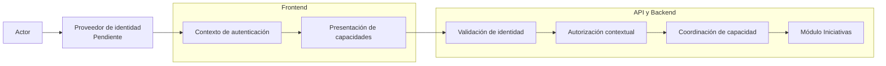

# Arauco Project Hub

## Engineering Playbook

# Arquitectura de Seguridad

**Versión:** 1.0

**Estado:** Approved

**Fecha:** 2026-06-28

---

# 1. Objetivo

Este documento define la arquitectura de seguridad inicial de Arauco Project Hub.

Su propósito es establecer cómo el Frontend, la API y el Backend colaboran para autenticar identidades, autorizar capacidades, proteger información y conservar trazabilidad sin reemplazar el Modelo de Permisos ni trasladar reglas del dominio a mecanismos técnicos.

Esta arquitectura no selecciona un proveedor de identidad ni un protocolo de autenticación.

---

# 2. Alcance

Este documento establece:

* Límites y responsabilidades de seguridad.
* Flujo general de autenticación y autorización.
* Relación entre identidad, Participante y Rol de Participación.
* Protección de comunicaciones, secretos, datos y errores.
* Reglas para sesiones, registros técnicos y pruebas.

Quedan fuera del alcance:

* Proveedor de identidad.
* Protocolo y mecanismo de autenticación.
* Duración y renovación de sesiones.
* Permisos no definidos en SRS-007.
* Clasificación corporativa de información.
* Servicios concretos de secretos, monitoreo o infraestructura.
* Acceso de integraciones y procesos técnicos.

---

# 3. Restricciones Aprobadas

La arquitectura debe:

* Exigir identidad autenticada para información no pública.
* Evaluar autorización en el Backend.
* Aplicar el Modelo de Permisos dentro del contexto de la Iniciativa.
* Distinguir identidad, Participante, Rol de Participación y reglas del dominio.
* Denegar capacidades sin permiso definido.
* Proteger comunicaciones y secretos.
* Minimizar la información expuesta.
* Evitar datos sensibles en errores y registros técnicos.
* Conservar identidad y Participante responsable en acciones relevantes.
* Mantener el Historial separado de la observabilidad técnica.

---

# 4. Principios

## 4.1 Confianza explícita

Cada solicitud protegida debe demostrar una identidad válida. La red, el Frontend o una sesión previa no conceden confianza implícita.

## 4.2 Autorización contextual

La autorización considera identidad, Iniciativa, Rol de Participación, capacidad y estado vigente cuando corresponda.

## 4.3 Menor privilegio

Solo se conceden permisos respaldados por SRS-007. La ausencia de definición implica denegación.

## 4.4 Responsabilidades separadas

* La autenticación confirma una identidad.
* La autorización determina si puede ejecutar una capacidad.
* El dominio valida reglas e invariantes.
* El Historial conserva acciones relevantes del producto.
* La observabilidad registra comportamiento técnico.

## 4.5 Protección por capas

Las validaciones del Frontend mejoran la experiencia, pero no sustituyen los controles de la API y el Backend.

---

# 5. Vista General

El proveedor de identidad acredita la identidad. Arauco Project Hub conserva la responsabilidad sobre Participantes, Roles de Participación, permisos y reglas del dominio.

---

# 6. Identidad y Participación

La identidad autenticada debe ser estable y permitir relacionar una acción con su responsable.

El Backend debe resolver, para la Iniciativa solicitada:

1. La identidad autenticada.
2. El Participante correspondiente.
3. Sus Roles de Participación.
4. Los permisos aplicables a la capacidad.

Una identidad puede tener roles distintos en diferentes Iniciativas. Los roles o grupos externos no deben reemplazar automáticamente el Modelo de Permisos.

La fuente corporativa de identidades y la vinculación con Participantes permanecen Pendientes.

---

# 7. Autenticación

## 7.1 Frontend

El Frontend debe:

* Iniciar y finalizar la autenticación mediante el mecanismo aprobado.
* Mantener solo el contexto mínimo necesario.
* Evitar exponer credenciales o secretos al código accesible por el navegador.
* Tratar la expiración o invalidez de la sesión de forma comprensible.
* No interpretar la presencia de una sesión como autorización.

## 7.2 API

La API debe:

* Validar la credencial en cada solicitud protegida.
* Rechazar credenciales ausentes, inválidas o expiradas.
* No confiar en identificadores de actor enviados libremente por el consumidor.
* Entregar a la coordinación una identidad validada.

## 7.3 Decisiones Pendientes

Proveedor, protocolo, almacenamiento de sesión, renovación, cierre y protección contra ataques asociados al mecanismo elegido requieren un ADR específico.

---

# 8. Autorización

La autorización ocurre antes de ejecutar una capacidad.

Flujo:

1. La API valida la identidad.
2. La coordinación identifica Iniciativa y capacidad.
3. Se recupera la participación requerida.
4. Se evalúan los permisos aprobados.
5. Si no existe permiso, se deniega sin modificar información.
6. Si existe permiso, el dominio evalúa sus reglas.

La autorización no debe:

* Implementarse únicamente en rutas o componentes del Frontend.
* Depender de datos de participación suministrados sin validación.
* Convertirse en reglas duplicadas dentro de cada endpoint.
* Conceder permisos por ausencia de definición.
* Confundir una regla del dominio con un permiso.

---

# 9. Frontend

El Frontend debe:

* Presentar únicamente acciones que el contexto conocido permite.
* Tratar esta presentación como experiencia, no como control definitivo.
* Manejar respuestas de acción no permitida sin exponer detalles.
* Limpiar información protegida al finalizar o invalidar la sesión.
* Evitar incluir secretos o información sensible en rutas y registros del navegador.

El mecanismo para obtener las capacidades permitidas permanece Pendiente.

---

# 10. API y Backend

La API y el Backend deben:

* Aplicar autenticación y autorización de forma uniforme.
* Validar contratos antes de usarlos.
* Minimizar datos de respuesta.
* Distinguir identidad inválida, acción no permitida y regla incumplida.
* Evitar filtrar la existencia de información que el actor no puede consultar.
* Conservar correlación técnica sin exponer detalles internos.
* Registrar la identidad y el Participante responsable cuando corresponda.

La respuesta pública no debe incluir excepciones, consultas, rutas físicas, secretos ni trazas.

---

# 11. Persistencia y Datos

La persistencia debe:

* Mantener integridad entre Iniciativa, Participante y Rol de Participación.
* Evitar que una consulta omita el alcance de autorización requerido.
* Proteger información almacenada conforme a su clasificación.
* Separar credenciales y secretos de los datos del dominio.
* Conservar Documentos, Conversaciones e Historial según las reglas aprobadas.

La tecnología de cifrado, administración de claves y clasificación de información permanecen Pendientes.

---

# 12. Comunicaciones y Secretos

* Toda comunicación protegida debe utilizar cifrado en tránsito.
* Los secretos no se almacenan en código ni configuración versionada.
* Cada componente utiliza únicamente las credenciales necesarias.
* Los secretos deben poder rotarse sin modificar el dominio.
* Ambientes distintos mantienen credenciales y configuración separadas.

El servicio de secretos y el ciclo de rotación requieren una decisión posterior.

---

# 13. Sesiones

La estrategia de sesión debe:

* Reducir exposición de credenciales.
* Permitir expiración e invalidación.
* Evitar reutilización indebida.
* Definir comportamiento ante múltiples ventanas y dispositivos.
* Mantener separados autenticación y estado de interfaz.

Su diseño depende del proveedor, protocolo, modo de renderizado y topología de despliegue. Estas decisiones deberán formalizarse mediante ADR.

---

# 14. Errores y Registros

Los errores de seguridad deben comunicar lo necesario sin revelar:

* Existencia de recursos protegidos.
* Detalles de validación de credenciales.
* Configuración interna.
* Datos sensibles.

Los registros técnicos deben:

* Permitir correlación y diagnóstico.
* Evitar secretos y datos sensibles completos.
* Registrar intentos relevantes conforme a una política aprobada.
* Mantenerse separados del Historial.

Retención, enmascaramiento y alertas permanecen Pendientes.

---

# 15. Amenazas Iniciales

La implementación debe considerar, como mínimo:

* Suplantación de identidad.
* Elevación de privilegios.
* Acceso a otra Iniciativa o Negocio.
* Manipulación de contratos.
* Exposición de secretos o información sensible.
* Reutilización de credenciales.
* Inyección de datos no confiables.
* Filtración mediante errores o registros.
* Modificación o pérdida de trazabilidad.

El modelado detallado de amenazas deberá actualizarse cuando se definan proveedor, infraestructura e integraciones.

---

# 16. Pruebas

La estrategia debe verificar:

* Solicitudes sin identidad, con identidad inválida y expirada.
* Permisos permitidos y denegados por Iniciativa.
* Separación entre Negocios.
* Combinación de varios Roles de Participación.
* Denegación de capacidades Pendientes.
* Acceso directo a la API sin controles del Frontend.
* Manipulación de identificadores y contratos.
* Errores sin información interna.
* Ausencia de secretos en repositorio y registros.
* Trazabilidad de acciones autorizadas.

---

# 17. Criterios de Cumplimiento

La implementación cumple cuando:

* Autentica toda solicitud protegida.
* Autoriza en el Backend usando el contexto de la Iniciativa.
* Aplica SRS-007 sin inventar permisos.
* Separa autorización y reglas del dominio.
* No confía en el Frontend como límite de seguridad.
* Protege comunicaciones y secretos.
* Minimiza datos expuestos.
* No revela detalles internos en errores.
* Conserva identidad y responsabilidad.
* Mantiene observabilidad e Historial separados.

---

# 18. Trazabilidad

Este documento deriva principalmente de:

* PHIL-001.
* SRS-006 - Requerimientos No Funcionales.
* SRS-007 - Modelo de Permisos.
* SRS-009 - Casos de Uso.
* Arquitectura del Backend.
* Arquitectura del Frontend.
* Diseño de la API.

---

# 19. Decisiones Arquitectónicas Requeridas

Se debe proponer ADR para:

* Proveedor de identidad y protocolo de autenticación.
* Estrategia de sesión.
* Protección de secretos y claves.
* Clasificación y cifrado de información cuando las alternativas impliquen trade-offs significativos.

---

# 20. Pendientes

* Seleccionar proveedor y protocolo de identidad.
* Definir vinculación entre identidad y Participante.
* Definir estrategia y duración de sesión.
* Definir clasificación de información.
* Definir cifrado y administración de claves.
* Definir servicio y rotación de secretos.
* Definir acceso técnico de integraciones.
* Definir registros, retención, enmascaramiento y alertas.
* Completar el modelado de amenazas.
* Definir la estrategia detallada de pruebas de seguridad.

---

# 21. Estado del Documento

**Estado actual:** Approved

Este documento constituye la fuente oficial de Arquitectura de Seguridad de Arauco Project Hub.
