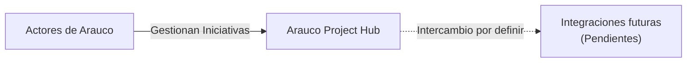
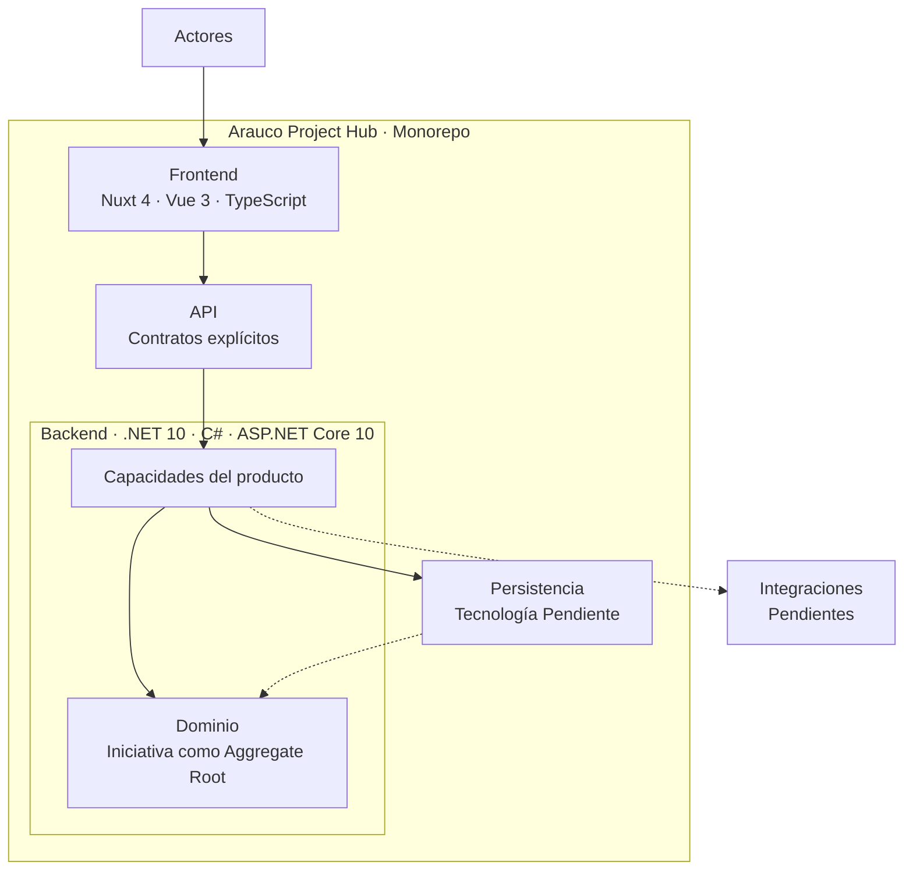

# Arauco Project Hub

## Engineering Playbook

# Visión de Arquitectura

**Versión:** 1.0

**Estado:** Approved

**Fecha:** 2026-06-28

---

# 1. Objetivo

Este documento consolida la visión arquitectónica de alto nivel de Arauco Project Hub.

Su propósito es mostrar cómo los actores, el Frontend, la API, el Backend, el dominio, la persistencia y las futuras integraciones colaboran para mantener el contexto completo de una Iniciativa.

Esta visión deriva de la Filosofía del Producto, los SRS y los ADR aprobados. No incorpora decisiones nuevas ni reemplaza los documentos que la sustentan.

---

# 2. Alcance

Este documento describe:

* Los principios que gobiernan la arquitectura.
* El contexto de Arauco Project Hub.
* Los componentes principales aprobados.
* Sus responsabilidades y dependencias permitidas.
* El flujo general de una interacción.
* Las decisiones que permanecen Pendientes.

Quedan fuera del alcance:

* La arquitectura interna definitiva del Frontend.
* La arquitectura interna definitiva del Backend.
* El diseño detallado de la API.
* La tecnología y estrategia de persistencia.
* La autenticación y autorización.
* Las integraciones específicas.
* La observabilidad.
* La infraestructura y el despliegue.
* La estructura física del monorepo.

---

# 3. Drivers Arquitectónicos

La arquitectura debe:

* Mantener a la Iniciativa como Aggregate Root principal.
* Conservar la continuidad desde la Idea hasta la Operación.
* Utilizar el Lenguaje Ubicuo.
* Mantener las reglas del dominio independientes de frameworks y persistencia.
* Preservar la trazabilidad de acciones y decisiones.
* Mantener una única fuente de verdad.
* Permitir múltiples Negocios sin fragmentar el producto.
* Favorecer la simplicidad sobre la flexibilidad no validada.
* Mantener límites explícitos entre Frontend, Backend, persistencia e integraciones.
* Permitir que las tecnologías evolucionen sin redefinir el dominio.

---

# 4. Principios Arquitectónicos

## 4.1 El dominio gobierna

Las capacidades y estructuras técnicas derivan de la Filosofía del Producto, el Lenguaje Ubicuo, el Modelo de Dominio y el Modelo Operacional.

Una conveniencia del framework, la API o la persistencia no puede redefinir conceptos ni reglas aprobadas.

## 4.2 La Iniciativa mantiene el contexto

El producto se organiza alrededor de la Iniciativa y conserva dentro de su contexto Participantes, Componentes, Recursos, Documentos, Conversaciones, Solicitudes, Versiones, Despliegues e Historial.

## 4.3 Las dependencias apuntan hacia el dominio

El Frontend, la API, la persistencia y las integraciones dependen de contratos y capacidades derivados del dominio.

Las reglas del dominio no dependen de Nuxt, ASP.NET Core, mecanismos de persistencia ni servicios externos.

## 4.4 Los contratos son explícitos

El Frontend y el Backend se comunican mediante contratos de API explícitos.

Las entidades del dominio y las estructuras de persistencia no se exponen directamente como contratos externos.

## 4.5 La trazabilidad es transversal

Las acciones relevantes deben conservar al menos qué ocurrió, cuándo ocurrió, quién participó y en qué Iniciativa ocurrió.

El Historial y las Conversaciones cumplen responsabilidades distintas y complementarias.

## 4.6 La arquitectura evoluciona mediante decisiones

Las decisiones importantes que completen o modifiquen esta visión deben documentarse mediante ADR.

---

# 5. Contexto

Arauco Project Hub permite que los actores definidos en SRS-002 colaboren sobre una Iniciativa durante su ciclo de vida.

Los actores utilizan Arauco Project Hub como fuente de verdad compartida. Las integraciones específicas se incorporarán únicamente cuando exista una necesidad aprobada.

---

# 6. Vista de Alto Nivel

Las flechas representan colaboración o adaptación, no acceso irrestricto. La persistencia representa y recupera el estado requerido por el dominio, pero no define sus reglas.

---

# 7. Responsabilidades

## 7.1 Frontend

Tecnologías aprobadas:

* Nuxt 4.
* Vue 3.
* TypeScript.

Responsabilidades:

* Presentar el contexto y ciclo de vida de la Iniciativa.
* Utilizar el Lenguaje Ubicuo.
* Coordinar navegación e interacción.
* Comunicarse con la API mediante contratos explícitos.
* Presentar errores y resultados de forma comprensible.

No le corresponde:

* Definir reglas del dominio.
* Acceder directamente a la persistencia.
* Reemplazar validaciones del Backend.
* Introducir estados o conceptos no aprobados.

## 7.2 API

Responsabilidades:

* Exponer capacidades del producto.
* Mantener contratos de entrada y salida explícitos.
* Traducir solicitudes externas hacia capacidades del Backend.
* Comunicar resultados y errores sin exponer detalles internos.

No le corresponde:

* Exponer directamente entidades del dominio.
* Exponer estructuras de persistencia.
* Convertirse en la ubicación principal de las reglas del dominio.

El estilo de endpoints permanece Pendiente.

## 7.3 Backend

Tecnologías aprobadas:

* .NET 10.
* C#.
* ASP.NET Core 10.

Responsabilidades:

* Coordinar las capacidades del producto.
* Proteger las reglas del dominio.
* Mantener a la Iniciativa como Aggregate Root principal.
* Aplicar autorizaciones cuando sean definidas.
* Coordinar persistencia e integraciones mediante límites explícitos.
* Generar la trazabilidad requerida.

No le corresponde:

* Permitir que ASP.NET Core defina el dominio.
* Exponer directamente la persistencia.
* Distribuir reglas entre endpoints e integraciones.

## 7.4 Dominio

Responsabilidades:

* Representar la Iniciativa y sus relaciones.
* Aplicar las reglas aprobadas.
* Mantener la consistencia de los cambios.
* Utilizar los Objetos de Valor gobernados.
* Mantener separados el Estado de Iniciativa y el Estado de Solicitud.
* Determinar las acciones relevantes que requieren trazabilidad.

El dominio no depende de Nuxt, ASP.NET Core, persistencia ni integraciones.

## 7.5 Persistencia

Responsabilidades:

* Representar el Modelo Relacional aprobado.
* Mantener integridad referencial.
* Persistir y recuperar el estado requerido por el Backend.
* Conservar Documentos, Conversaciones e Historial según las reglas aprobadas.

No le corresponde:

* Definir conceptos o reglas del dominio.
* Convertir tablas o estructuras físicas en contratos de API.
* Eliminar trazabilidad al cerrar o cancelar una Iniciativa.

La tecnología, estrategia de acceso y tipos físicos permanecen Pendientes.

## 7.6 Integraciones

Responsabilidades:

* Adaptar servicios externos al dominio de Arauco Project Hub.
* Evitar que términos externos reemplacen el Lenguaje Ubicuo.
* Mantener trazabilidad de intercambios relevantes cuando corresponda.

Las integraciones específicas permanecen Pendientes.

---

# 8. Flujo General

Una interacción sigue este flujo:

1. Un actor inicia una acción desde el Frontend.
2. El Frontend construye una solicitud conforme al contrato de la API.
3. La API valida el contrato externo y dirige la solicitud a la capacidad correspondiente.
4. El Backend recupera el contexto necesario.
5. El dominio evalúa y aplica las reglas aprobadas.
6. El Backend coordina la persistencia del resultado.
7. Si corresponde, se registra el evento del Historial y la responsabilidad involucrada.
8. El Backend devuelve un resultado mediante el contrato de la API.
9. El Frontend presenta el resultado actualizado al actor.

Las integraciones se incorporarán a este flujo mediante límites explícitos cuando sean aprobadas.

---

# 9. Dependencias Permitidas

| Origen | Puede depender de | No debe depender directamente de |
| --- | --- | --- |
| Frontend | Contratos de la API y capacidades de Nuxt/Vue. | Persistencia y detalles internos del dominio. |
| API | Capacidades del Backend y ASP.NET Core. | Estructuras físicas de persistencia como contrato externo. |
| Backend | Dominio, contratos de persistencia e integraciones. | Detalles internos del Frontend. |
| Dominio | Conceptos y reglas aprobadas. | Nuxt, ASP.NET Core, persistencia e integraciones. |
| Persistencia | Contratos definidos por el Backend y Modelo Relacional. | Pantallas o decisiones particulares del Frontend. |
| Integraciones | Contratos de adaptación definidos por el Backend. | Entidades internas sin adaptación. |

---

# 10. Organización del Repositorio

Arauco Project Hub se mantiene en un monorepo.

El monorepo debe:

* Mantener juntos el Engineering Playbook y los componentes del producto.
* Conservar límites y validaciones independientes para Frontend y Backend.
* Permitir cambios trazables entre documentación e implementación.
* Evitar dependencias entre componentes por mera conveniencia.
* Permitir ciclos de construcción y despliegue independientes.

La estructura física de carpetas y las herramientas del monorepo permanecen Pendientes.

---

# 11. Decisiones Aprobadas

| Documento | Decisión |
| --- | --- |
| ADR-001 | La arquitectura se deriva del dominio aprobado. |
| ADR-002 | El producto se organiza en un monorepo. |
| ADR-003 | El Frontend utiliza Nuxt 4, Vue 3 y TypeScript. |
| ADR-004 | El Backend utiliza .NET 10, C# y ASP.NET Core 10. |
| SRS-010 | El Modelo Relacional deriva del Modelo de Dominio. |
| DER | Las estructuras y relaciones se representan visualmente sin redefinir el dominio. |
| Diccionario de Datos | Los datos cuentan con nombres físicos provisionales, tipos lógicos y claves documentadas. |

---

# 12. Pendientes

* Definir la arquitectura interna del Backend.
* Definir la arquitectura interna del Frontend.
* Definir los módulos y sus responsabilidades.
* Definir el diseño de la API.
* Definir la tecnología y estrategia de persistencia.
* Definir autenticación y autorización.
* Definir seguridad y protección de la información.
* Definir observabilidad.
* Definir infraestructura y despliegue.
* Definir integraciones específicas.
* Definir la estructura física del monorepo.
* Definir la estrategia de pruebas.

Cada decisión arquitectónica importante deberá documentarse mediante ADR.

---

# 13. Trazabilidad

Esta visión deriva principalmente de:

* PHIL-001.
* SRS-001 - Visión del Producto.
* SRS-002 - Lenguaje Ubicuo.
* SRS-003 - Modelo de Dominio.
* SRS-004 - Modelo Operacional.
* SRS-010 - Modelo Relacional.
* ADR-001 - Arquitectura Basada en el Negocio.
* ADR-002 - Monorepo.
* ADR-003 - Frontend con Nuxt 4.
* ADR-004 - Backend con .NET 10.
* DER.
* Diccionario de Datos.

Si existe una diferencia entre esta visión y un documento aprobado de mayor prioridad, prevalece el documento de mayor prioridad.

---

# 14. Estado del Documento

**Estado actual:** Approved

Este documento constituye la visión arquitectónica oficial de Arauco Project Hub.
