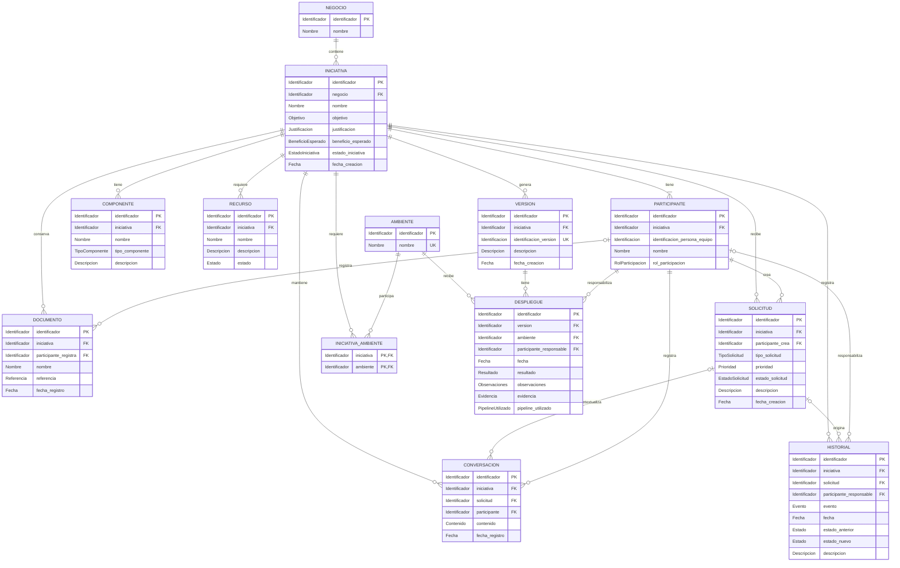

# Arauco Project Hub

## Engineering Playbook

# DER - Diagrama de Entidad-Relación

**Versión:** 1.0

**Estado:** Approved

**Fecha:** 2026-06-28

---

# 1. Objetivo

Este documento representa visualmente las estructuras y relaciones aprobadas en SRS-010 - Modelo Relacional.

Su propósito es facilitar la comprensión del Modelo Relacional y verificar que la persistencia conserve a la Iniciativa como Aggregate Root principal, mantenga el contexto de sus estructuras y proteja la trazabilidad.

El DER deriva de SRS-010. No redefine el Modelo de Dominio, no incorpora conceptos nuevos y no reemplaza las reglas aprobadas.

---

# 2. Alcance

Este DER representa:

* Las estructuras relacionales aprobadas.
* Sus claves primarias y foráneas.
* Los datos mínimos definidos en SRS-010.
* Las cardinalidades entre estructuras.
* Las relaciones necesarias para conservar el contexto de una Iniciativa.

Quedan fuera del alcance:

* Los tipos de datos específicos de una tecnología.
* Los nombres físicos definitivos.
* Los índices.
* La estrategia de generación de identificadores.
* La estrategia de acceso a datos.
* La selección del motor de base de datos.
* Los Objetos de Valor como estructuras físicas.
* Los atributos y relaciones que SRS-010 mantiene Pendientes.

---

# 3. Convenciones

El diagrama utiliza las siguientes marcas:

| Marca | Significado |
| --- | --- |
| `PK` | Clave primaria. |
| `FK` | Clave foránea. |
| `UK` | Valor o combinación que no se repite dentro del contexto indicado. |
| `||` | Exactamente uno. |
| `o|` | Cero o uno. |
| `|{` | Uno o muchos. |
| `o{` | Cero o muchos. |

Los atributos utilizan nombres técnicos provisionales derivados del Lenguaje Ubicuo. El Diccionario de Datos definirá posteriormente sus nombres físicos, obligatoriedad y tipos de datos.

---

# 4. Diagrama

---

# 5. Relaciones

| Origen | Relación | Destino | Cardinalidad |
| --- | --- | --- | --- |
| Negocio | Contiene | Iniciativa | Un Negocio puede contener muchas Iniciativas; cada Iniciativa pertenece a un Negocio. |
| Iniciativa | Tiene | Participante | Una Iniciativa tiene uno o más Participantes; cada Participante pertenece a una Iniciativa. |
| Iniciativa | Tiene | Componente | Una Iniciativa puede tener muchos Componentes; cada Componente pertenece a una Iniciativa. |
| Iniciativa | Requiere | Recurso | Una Iniciativa puede requerir muchos Recursos; cada Recurso pertenece a una Iniciativa. |
| Iniciativa | Conserva | Documento | Una Iniciativa puede conservar muchos Documentos; cada Documento pertenece a una Iniciativa. |
| Iniciativa | Mantiene | Conversación | Una Iniciativa puede mantener muchas Conversaciones; cada Conversación pertenece a una Iniciativa. |
| Iniciativa | Recibe | Solicitud | Una Iniciativa puede recibir muchas Solicitudes; cada Solicitud pertenece a una Iniciativa. |
| Iniciativa | Genera | Versión | Una Iniciativa puede generar muchas Versiones; cada Versión pertenece a una Iniciativa. |
| Iniciativa | Registra | Historial | Una Iniciativa puede registrar muchos eventos del Historial; cada evento pertenece a una Iniciativa. |
| Iniciativa | Requiere | Ambiente | Una Iniciativa puede requerir muchos Ambientes y un Ambiente puede ser requerido por muchas Iniciativas. |
| Solicitud | Contextualiza | Conversación | Una Solicitud puede tener muchas Conversaciones; una Conversación puede pertenecer a una Solicitud. |
| Solicitud | Origina | Historial | Una Solicitud puede originar muchos eventos del Historial; un evento puede referenciar una Solicitud. |
| Versión | Tiene | Despliegue | Una Versión puede tener muchos Despliegues; cada Despliegue pertenece a una Versión. |
| Ambiente | Recibe | Despliegue | Un Ambiente puede recibir muchos Despliegues; cada Despliegue ocurre en un Ambiente. |
| Participante | Registra | Conversación | Un Participante puede registrar muchas Conversaciones; cada Conversación identifica al Participante que la registra. |
| Participante | Participa en la trazabilidad | Documento, Solicitud, Despliegue e Historial | Cada referencia conserva al Participante involucrado cuando corresponde. |

---

# 6. Integridad

El DER aplica las siguientes condiciones aprobadas en SRS-010:

* Una Iniciativa no existe sin un Negocio.
* Una Solicitud no existe fuera del contexto de una Iniciativa.
* Una Conversación pertenece siempre a una Iniciativa.
* Si una Conversación referencia una Solicitud, ambas pertenecen a la misma Iniciativa.
* Una Versión y sus Despliegues permanecen dentro del contexto de una misma Iniciativa.
* Un Despliegue identifica la Versión publicada y el Ambiente donde ocurre.
* Una combinación de Iniciativa y Ambiente no se repite.
* La Identificación de Versión no se repite dentro de una misma Iniciativa.
* El Estado de Iniciativa y el Estado de Solicitud se mantienen independientes.
* Los eventos del Historial no reemplazan el estado actual ni se modifican para sustituir lo ocurrido.

Las condiciones que dependen del significado del dominio deben protegerse en el dominio, aunque la persistencia también aplique restricciones de integridad.

---

# 7. Trazabilidad

| Elemento del DER | Fuente |
| --- | --- |
| Estructuras, atributos mínimos y relaciones | SRS-010, secciones 5 y 7. |
| Cardinalidades | SRS-003, sección 6; SRS-010, secciones 5 y 7. |
| Integridad | SRS-010, sección 8. |
| Iniciativa como Aggregate Root principal | SRS-003, ADR-001 y SRS-010. |
| Contexto y trazabilidad | PHIL-001, SRS-004, ADR-001 y SRS-010. |

SRS-010 permanece como fuente oficial. Si existe una diferencia entre este DER y SRS-010, prevalece SRS-010.

---

# 8. Pendientes

* Validar visualmente las cardinalidades con los actores responsables.
* Definir los atributos específicos que permanecen Pendientes en SRS-010.
* Definir los Estados de Recurso.
* Definir los valores de Resultado de Despliegue.
* Definir el catálogo de eventos del dominio.
* Aclarar qué Rol de Participación representa al responsable TI.
* Validar la relación entre Solicitudes y Versiones antes de incorporarla al DER.
* Resolver el Pendiente respecto del concepto Solución.
* Elaborar el Diccionario de Datos después de aprobar este documento.
* Documentar mediante ADR la selección de la tecnología y la estrategia de persistencia cuando corresponda.

---

# 9. Estado del Documento

**Estado actual:** Approved

Este documento constituye la representación visual oficial del Modelo Relacional de Arauco Project Hub.
