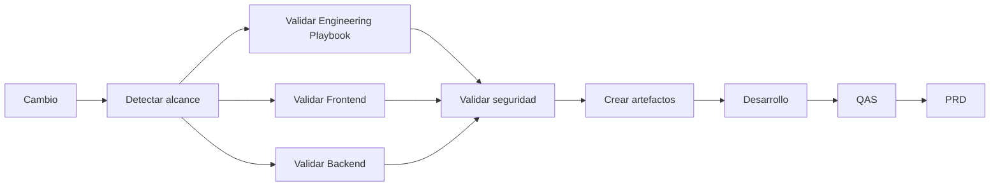

# Arauco Project Hub

## Engineering Playbook

# EST-005 - CI/CD

**Versión:** 1.0

**Estado:** Approved

**Fecha:** 2026-06-30

---

# 1. Objetivo

Este documento define el estándar de integración y entrega continua para el monorepo de Arauco Project Hub.

Su propósito es asegurar que cada cambio sea reproducible, verificable, trazable y seguro, y que todo Despliegue permita identificar la Versión utilizada, verificar su resultado y recuperar la operación cuando sea necesario.

---

# 2. Alcance

Este estándar establece:

* Los eventos que inician validaciones.
* Las etapas lógicas de integración continua.
* Las validaciones del Engineering Playbook, Frontend y Backend.
* La creación y promoción de artefactos.
* Los controles de seguridad y secretos.
* Las condiciones generales de entrega y Despliegue por Ambiente.
* Las evidencias, aprobaciones y criterios de reversión.

Este documento no:

* Selecciona una plataforma de despliegue.
* Define infraestructura ni topología.
* Autoriza contenedores, Kubernetes o infraestructura como código.
* Define comandos que todavía no existen en la implementación.
* Fija umbrales de cobertura no aprobados.
* Define SLA, RPO o RTO.
* Sustituye la revisión técnica.

---

# 3. Principios

## 3.1 Un cambio no se integra sin evidencia

Todo cambio debe producir evidencia proporcional a su alcance y riesgo.

Una validación exitosa no reemplaza la revisión del Lenguaje Ubicuo, las reglas del dominio ni la coherencia con la documentación Approved.

## 3.2 Construir una vez, promover el mismo artefacto

Una Versión debe construirse una sola vez. El mismo artefacto verificable se promueve entre Ambientes sin recompilarlo con contenido distinto.

La configuración específica de cada Ambiente se aplica fuera del artefacto.

## 3.3 Fallar antes de desplegar

Las validaciones rápidas y deterministas se ejecutan antes de las más costosas.

Un fallo bloqueante debe detener la integración o promoción y comunicar una causa reconocible.

## 3.4 Separación de Ambientes

Desarrollo, QAS y PRD mantienen configuración, credenciales, datos y evidencias separadas.

El acceso a un Ambiente no implica acceso a otro.

## 3.5 Menor privilegio y sin secretos persistentes

La automatización utiliza identidades acotadas a su responsabilidad.

Se debe preferir identidad federada o administrada frente a credenciales de larga duración cuando la plataforma aprobada lo permita.

## 3.6 El Despliegue es verificable y reversible

Cada Despliegue debe identificar la Versión, registrar su resultado y contar con una estrategia de reversión o recuperación proporcional al riesgo.

---

# 4. Plataforma de Automatización

Se propone utilizar GitHub Actions para la automatización del repositorio porque:

* El monorepo ya reserva `/.github` para automatización y plantillas.
* Permite validar cambios por pull request y por actualización de la rama principal.
* Permite separar permisos por workflow y trabajo.
* Permite reutilizar workflows sin incorporar una herramienta de gestión del monorepo.
* Mantiene configuración y evidencia junto al repositorio.

Esta selección no autoriza una plataforma de despliegue ni acciones de terceros sin revisión.

GitHub y GitHub Actions deben formar parte de las plataformas corporativas permitidas antes de implementar este flujo. Si no lo están, se debe revisar este Standard y conservar el flujo lógico sustituyendo únicamente el mecanismo de ejecución.

---

# 5. Eventos

La integración continua debe ejecutarse ante:

* Creación o actualización de un pull request hacia la rama principal.
* Actualización de la rama principal.
* Ejecución manual autorizada para diagnóstico o recuperación.

La entrega debe ejecutarse únicamente desde una Versión integrada y verificable.

No se desplegará código arbitrario desde una rama de trabajo hacia PRD.

Los eventos automáticos deben evitar ejecuciones duplicadas para una misma revisión cuando una ejecución más reciente la reemplaza.

---

# 6. Flujo General

Las transiciones hacia Ambientes representan el flujo lógico. No seleccionan todavía un mecanismo de despliegue.

---

# 7. Detección de Alcance

La automatización debe identificar si el cambio afecta:

* Engineering Playbook.
* Frontend.
* Backend.
* Contratos entre Frontend y Backend.
* Persistencia o migraciones.
* Automatización.
* Más de un componente.

La ejecución selectiva se permite cuando:

* El límite afectado puede determinarse de manera confiable.
* Se incluyen dependencias directas e indirectas.
* La rama principal conserva una validación integral proporcional al riesgo.

Ante duda sobre el alcance, se ejecuta el conjunto más amplio de validaciones aplicables.

---

# 8. Validación del Engineering Playbook

Los cambios documentales deben verificar:

* Estructura Markdown válida.
* Enlaces internos cuando exista una herramienta aprobada.
* Estado y versión del documento.
* Coherencia de referencias.
* Ausencia de términos prohibidos utilizados como equivalentes.
* Actualización de `CURRENT_STATE.md` y `changelog.md` cuando corresponde.
* Ausencia de modificaciones no autorizadas a documentos Approved.

La automatización puede detectar forma y referencias, pero la coherencia con la Filosofía del Producto, SRS y ADR requiere revisión.

---

# 9. Validación del Frontend

Cuando exista implementación, el Frontend debe ejecutar como mínimo:

1. Restauración reproducible de dependencias desde su archivo de resolución.
2. Validación de formato.
3. Análisis estático.
4. Verificación de tipos TypeScript.
5. Pruebas automatizadas del alcance afectado.
6. Construcción de Nuxt.
7. Verificaciones de contratos cuando correspondan.

Las pruebas deben cubrir presentación, coordinación, comunicación con la API y flujos según la responsabilidad modificada.

La matriz de navegadores y las pruebas de accesibilidad se incorporarán cuando sus criterios sean aprobados.

---

# 10. Validación del Backend

El Backend debe ejecutar como mínimo:

1. Restauración reproducible de dependencias.
2. Validación de formato.
3. Compilación con .NET 10.
4. Pruebas del Modelo de Dominio.
5. Pruebas de coordinación.
6. Pruebas de contratos y API.
7. Pruebas de persistencia cuando el cambio la afecte.
8. Validación de dependencias arquitectónicas.

Las advertencias nuevas deben tratarse como fallos cuando la configuración aprobada así lo establezca.

Las pruebas del Modelo de Dominio no deben requerir Frontend, ASP.NET Core, persistencia ni integraciones.

---

# 11. Contratos y Cambios Transversales

Un cambio que afecte Frontend y Backend debe:

* Verificar compatibilidad de contratos.
* Ejecutar validaciones de ambos componentes.
* Confirmar que el Lenguaje Ubicuo mantiene el mismo significado.
* Evitar que el Frontend dependa de entidades internas del Backend.
* Incluir una estrategia de transición cuando exista incompatibilidad.

Los contratos generados, si se incorporan posteriormente, deben ser reproducibles y no convertirse en una segunda fuente del dominio.

---

# 12. Persistencia y Migraciones

Una migración debe:

* Derivar de documentación Approved.
* Permanecer versionada en el monorepo.
* Ser revisable antes de aplicarse.
* Verificar que el modelo resultante coincide con el Modelo Relacional, DER y Diccionario de Datos.
* Contar con una estrategia de despliegue y recuperación proporcional al cambio.
* Mantener trazabilidad hacia la Versión que la contiene.

La automatización no debe aplicar migraciones al iniciar la aplicación en PRD.

La aplicación de migraciones debe ser una etapa explícita, autorizada y observable. Su mecanismo definitivo depende de la plataforma de despliegue.

---

# 13. Seguridad de la Integración

La integración debe verificar:

* Ausencia de secretos versionados.
* Vulnerabilidades conocidas en dependencias.
* Integridad de archivos de resolución.
* Permisos mínimos del workflow.
* Uso controlado de acciones y dependencias externas.
* Ausencia de artefactos con credenciales o configuración sensible.

Las acciones externas deben:

* Tener un propósito necesario.
* Utilizar una versión inmutable o referencia controlada.
* Revisarse antes de incorporarse.
* Mantener permisos mínimos.

Los resultados no deben exponer secretos, referencias de sesión ni información sensible.

---

# 14. Artefactos y Versiones

Cada artefacto debe:

* Ser inmutable.
* Relacionarse con un commit exacto.
* Identificar su componente.
* Mantener metadatos suficientes para verificar origen y construcción.
* Evitar secretos y configuración específica de un Ambiente.
* Conservarse durante un período aprobado.

La identificación inicial debe incluir el hash completo o corto no ambiguo del commit.

No se utilizarán etiquetas mutables como `latest` para identificar una Versión desplegada en PRD.

La estrategia de versionado funcional, registro y retención de artefactos permanece Pendiente.

---

# 15. Entrega por Ambiente

## 15.1 Desarrollo

Desarrollo recibe una Versión integrada para validar funcionamiento técnico temprano.

El Despliegue debe:

* Utilizar configuración y credenciales propias.
* Ejecutar verificaciones de estado.
* Registrar la Versión y el resultado.

## 15.2 QAS

La promoción a QAS requiere:

* Artefacto aprobado en la etapa anterior.
* Validaciones automáticas exitosas.
* Migraciones revisadas cuando correspondan.
* Criterios de prueba identificados.

QAS debe permitir validar capacidades y regresiones antes de PRD.

## 15.3 PRD

La promoción a PRD requiere:

* La misma Versión verificada en QAS.
* Aprobación explícita del responsable definido.
* Estrategia de reversión o recuperación.
* Ventana y comunicación cuando correspondan.
* Verificación posterior al Despliegue.

No se realizará un Despliegue automático a PRD únicamente por integrar un cambio en la rama principal.

---

# 16. Verificación Posterior

Después de un Despliegue se debe verificar:

* Identidad de la Versión.
* Estado técnico del componente.
* Disponibilidad de dependencias críticas.
* Capacidad representativa sin modificar información de forma insegura.
* Ausencia de aumento inesperado de errores.
* Correlación de señales entre componentes.
* Resultado de migraciones cuando correspondan.

Una verificación fallida bloquea la promoción siguiente y activa la evaluación de reversión o recuperación.

Los umbrales concretos dependen de objetivos operacionales aprobados.

---

# 17. Reversión y Recuperación

Antes de promover una Versión se debe documentar:

* Condiciones que activan la reversión.
* Responsable de decidirla.
* Versión estable anterior.
* Procedimiento aplicable.
* Tratamiento de migraciones y compatibilidad de datos.
* Verificación posterior.

La reversión de código no implica automáticamente la reversión de datos.

Una migración destructiva o incompatible requiere una estrategia específica y no puede depender únicamente de volver a desplegar un artefacto anterior.

---

# 18. Permisos y Aprobaciones

La automatización debe separar:

* Lectura del repositorio.
* Escritura de evidencia o artefactos.
* Acceso a cada Ambiente.
* Aplicación de migraciones.
* Aprobación de PRD.

Un workflow de pull request proveniente de un origen no confiable no debe recibir secretos ni permisos de despliegue.

Las identidades de automatización no deben reutilizar credenciales personales.

Los responsables concretos y las reglas de aprobación permanecen Pendientes de la política corporativa.

---

# 19. Evidencia y Trazabilidad

Cada ejecución debe conservar, según corresponda:

* Commit y rama.
* Componentes afectados.
* Versiones de herramientas.
* Resultado de cada validación.
* Artefactos producidos.
* Ambiente de destino.
* Aprobaciones.
* Resultado del Despliegue.
* Verificación posterior.
* Reversión o recuperación ejecutada.

La evidencia técnica de CI/CD no reemplaza el Historial del producto.

---

# 20. Fallos y Reintentos

Un fallo debe:

* Detener las etapas dependientes.
* Identificar la validación que falló.
* Evitar publicar o promover artefactos incompletos.
* Evitar mensajes que expongan información sensible.

Un reintento solo se permite cuando:

* La operación es segura.
* No oculta un fallo determinista.
* No duplica una modificación.
* Conserva evidencia del intento anterior.

---

# 21. Criterios de Cumplimiento

El flujo cumple este estándar cuando:

* Valida cambios antes de integrarlos.
* Ejecuta validaciones proporcionales al alcance.
* Construye de forma reproducible.
* Mantiene Frontend y Backend verificables de forma independiente.
* Verifica contratos en cambios transversales.
* Revisa migraciones antes de aplicarlas.
* Produce artefactos inmutables relacionados con un commit.
* Promueve el mismo artefacto entre Ambientes.
* Mantiene secretos fuera del repositorio y de los artefactos.
* Separa permisos y configuración por Ambiente.
* Exige aprobación explícita antes de PRD.
* Registra Versión y resultado de cada Despliegue.
* Verifica el resultado y permite reversión o recuperación.
* No selecciona ni utiliza una plataforma de despliegue no aprobada.

---

# 22. Trazabilidad

Este estándar deriva principalmente de:

* PHIL-001: FP-005, FP-006, FP-009, FP-011, FP-012 y FP-013.
* SRS-006: RNF-003, RNF-006, RNF-038 a RNF-048.
* ADR-002 - Monorepo.
* ADR-003 - Frontend con Nuxt 4.
* ADR-004 - Backend con .NET 10.
* ADR-006 - Tecnología y Estrategia de Persistencia.
* ADR-007 - Plataforma y Estándar de Observabilidad.
* EST-001 - Estándar Tecnológico.
* EST-002 - Estándar Azure.
* EST-003 - Convención de Repositorios.
* EST-004 - Convención de Nombres.

---

# 23. Validaciones de Implementación

* Confirmar GitHub Actions como plataforma corporativa permitida.
* Definir comandos reales cuando existan Frontend y Backend.
* Seleccionar herramientas de formato, análisis estático y pruebas.
* Definir la estrategia y umbrales de cobertura.
* Confirmar análisis de vulnerabilidades y detección de secretos.
* Definir el registro y retención de artefactos.
* Definir responsables y reglas de aprobación.
* Aprobar la plataforma y estrategia de despliegue mediante ADR.
* Definir la ejecución y recuperación de migraciones.
* Definir verificaciones posteriores y umbrales operacionales.

---

# 24. Decisión Arquitectónica Requerida

Antes de implementar entrega o Despliegue se debe proponer un ADR que seleccione:

* Plataforma de ejecución para Frontend y Backend.
* Forma de empaquetado.
* Topología y límites de red.
* Mecanismo de configuración y secretos.
* Identidad de ejecución y despliegue.
* Estrategia de Despliegue y reversión.
* Mecanismo para aplicar migraciones.

Esta decisión es arquitectónica porque condiciona identidad, sesiones, observabilidad, disponibilidad, recuperación y costo.

---

# 25. Siguiente Paso

Después de aprobar EST-005, el siguiente documento propuesto es:

ADR-008 - Plataforma y Estrategia de Despliegue.

Objetivo:

Seleccionar la plataforma de ejecución para Frontend y Backend, la forma de empaquetado, la topología, la configuración, la identidad, la estrategia de Despliegue y el mecanismo de migraciones.

La implementación no debe comenzar con una plataforma de despliegue asumida. Si se requiere automatizar entrega o Despliegue, primero se debe crear el ADR indicado en este documento.

---

# 26. Estado del Documento

**Estado actual:** Approved

Este documento constituye la fuente oficial para la integración y entrega continua de Arauco Project Hub.
